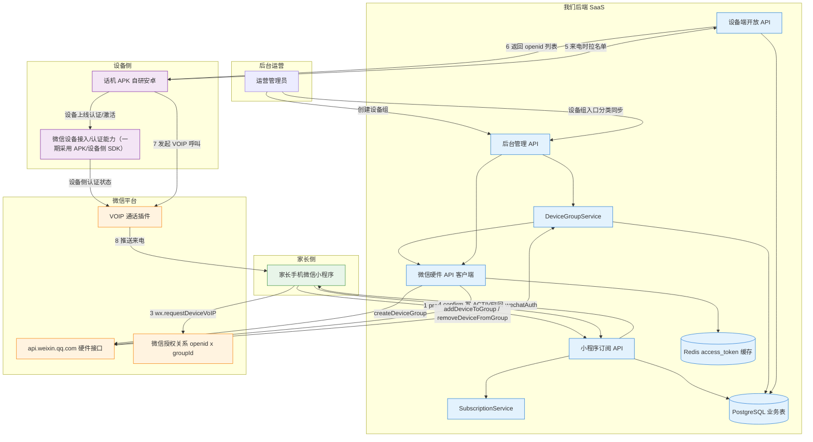
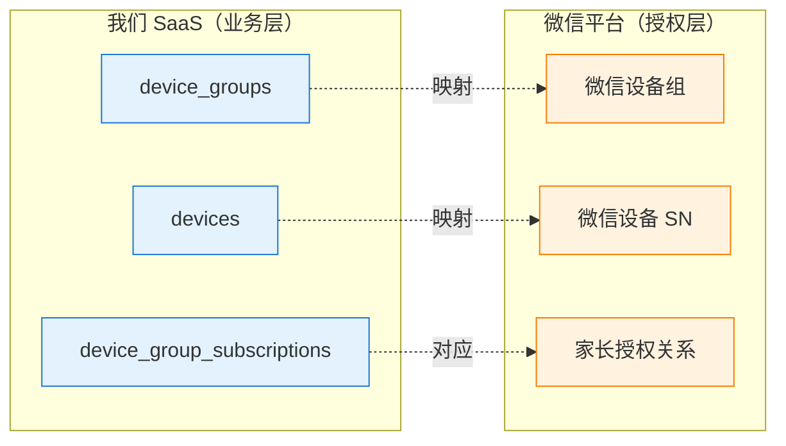
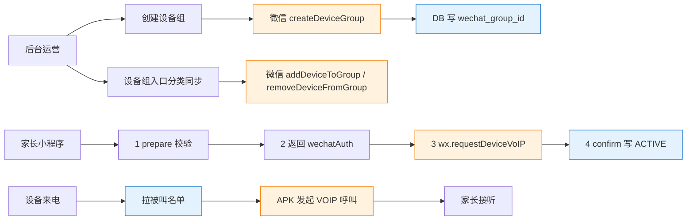
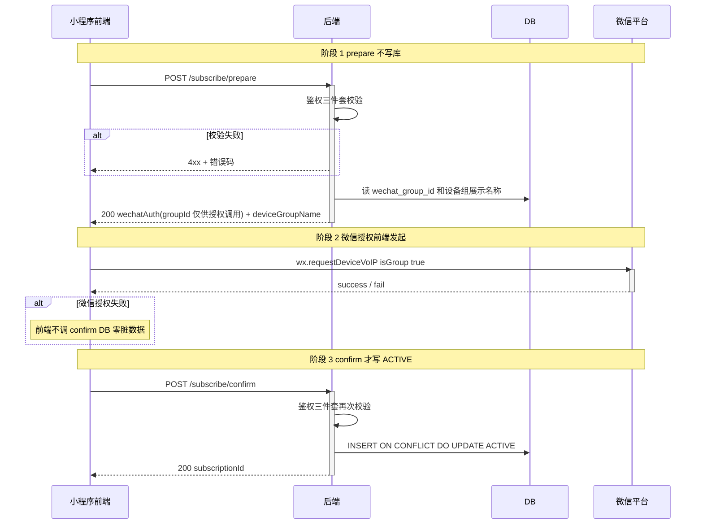
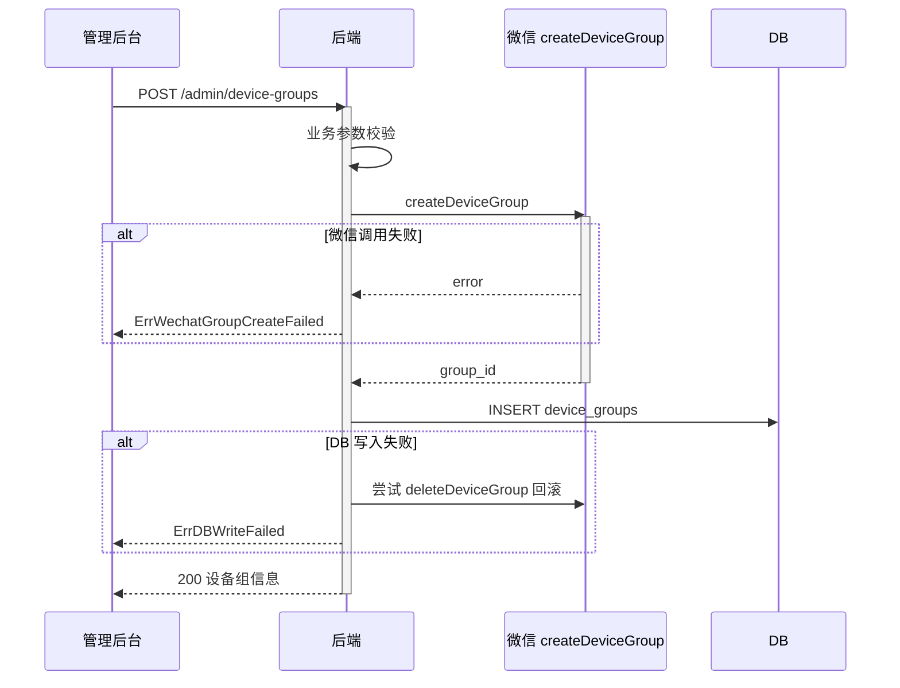
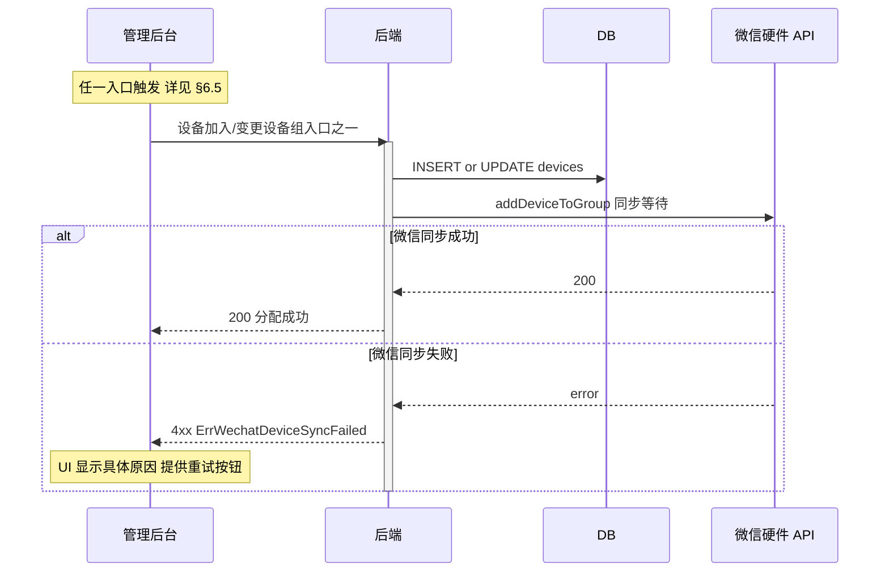
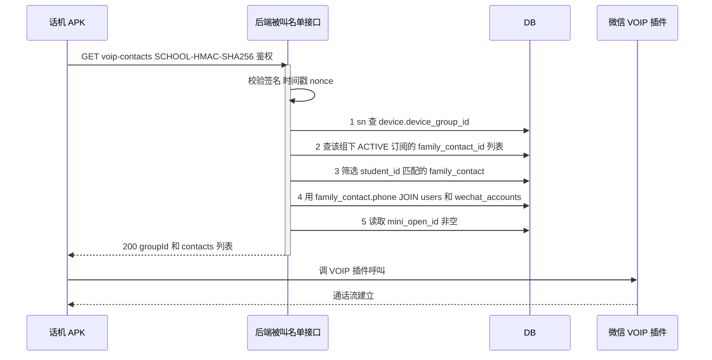
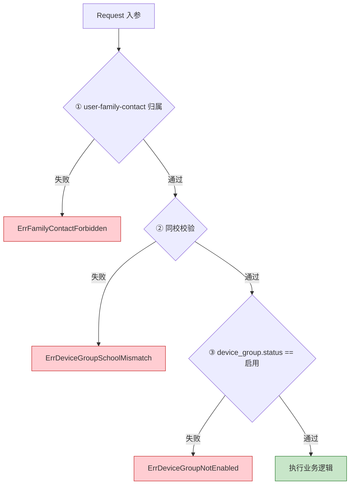
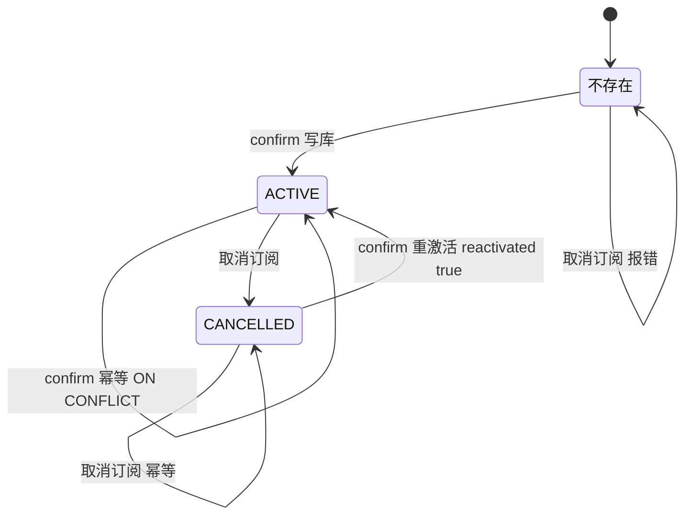

# 自研 APK 微信 VOIP 设备组授权与被叫名单设计（阶段一）

> 创建日期：2026-05-12
> 状态：**设计可实施**，已吸收 codex 代码审查与复审意见
> 关联文档：
>
> - `docs/design/设备组订阅系统设计文档.md`（早期方案，部分能力未落地）
> - `docs/design/2026-04-28-phone-design.md`（话机业务建设与设计）
>
> 关联微信文档：
>
> - [硬件设备 - 设备组](https://developers.weixin.qq.com/miniprogram/dev/framework/device/device-group.html)
> - [音视频通话 - 用户授权设备](https://developers.weixin.qq.com/miniprogram/dev/framework/device/voip/auth.html)
> - [wx.requestDeviceVoIP](https://developers.weixin.qq.com/miniprogram/dev/api/open-api/device-voip/wx.requestDeviceVoIP.html)
>
> **v6 修订摘要**（澄清微信 group 授权与设备 SN 的关系）：
>
> 1. 老数据由软删除改为**物理删除**（避免 `code` 唯一索引阻塞重建）
> 2. 订阅改为 **prepare/confirm 两阶段提交**（避免 DB 已写 / 微信未授权脏状态）
> 3. 被叫名单接口鉴权改为现有的 **SCHOOL-HMAC-SHA256** 格式
> 4. 设备组同步入口改为**分类覆盖**：不新增设备注册链路，只在设备加入/变更/删除设备组时同步微信 group 成员
> 5. `device_group_subscriptions` 加 **全量唯一索引**（并发安全 + 支持 CANCELLED 重激活）
> 6. **access_token Redis 缓存纳入本期**（避免微信限流）
>
> **v7 修订摘要**（评审反馈落地，修复阻塞实施的设计缺陷）：
>
> 1. **所有微信同步入口与测试数据清理 SQL 加 `is_voip_group = true` 过滤**——避免误伤吹风机/消费机的普通设备分组
> 2. 明确 **`IsVoipGroup` 字段一经设定不允许变更**，配套后端校验与后台 UI 禁用
> 3. **沿用现有开放接口鉴权体系**——仅为 `voip-contacts` 补充必要权限配置，不做权限体系重构
> 4. **access_token 缓存改用 `stable_token` 接口 + Redis SETNX 单飞锁**——避免普通 token 接口"新令牌让旧令牌作废"的缓存毒化
> 5. **批量绑组/批量导入后端强制单批 ≤ 20 台**——不依赖前端契约约束流量
> 6. 明确 **重激活 `ON CONFLICT` 时 `created_by` 保留、`subscribed_at` 重置、`updated_by` 覆盖**
> 7. **微信 API 客户端识别"设备/分组不存在"错误码归一化为成功**——避免本地孤儿设备永远删不掉
>
> **v8 修订摘要**（产品化表达与技术参数边界）：
>
> 1. 文档文件名去掉日期前缀，改为 `自研APK微信VOIP设备组授权与被叫名单设计文档.md`
> 2. 明确用户只理解和操作“业务设备组名称”，不展示、不填写、不解释 `wechat_group_id` / `groupId` / `model_id` / `snTicket` 等技术参数
> 3. `prepare` 返回的微信授权参数仅供小程序前端调用微信接口，不作为页面展示字段，也不允许前端自行构造
> 4. 微信平台 `model_id` 已确认为 `kBD0lTsIkrMDUZ3ySeCEcQ`，作为后端内部配置项处理

---

## 1. 概述

### 1.1 背景

当前"家长订阅设备组"的入口**完全由第三方鑫智 XSTC 平台反向驱动**：

```
鑫智小程序操作 → POST /ghAppController/submitData (operation=submitBindingVoipGroup)
                → ghDeviceService.SubmitBindingVoipGroup
                → handleSubscribe / handleUnsubscribe → device_group_subscriptions 表
```

因 VOIP 业务自研，鑫智不再回调，家长**无任何方式发起订阅**——存量订阅可用，新订阅链路断裂。

**业务决策**：本期不是重做 VOIP 系统，也不是重构历史话机能力；现有设备初始化、联系人、通话上报、通话记录和计费链路继续沿用。本期只补齐自研 APK 接入后缺失的三块能力：家长小程序设备组授权、微信设备组与设备 SN 关系维护、APK 发起呼叫前获取可信被叫名单。

**数据前提**：当前 VOIP 设备组订阅链路尚未正式对外使用，无需要迁移的有效家长订阅数据。因此上线前仅清理未正式使用的 VOIP 设备组/订阅测试数据，避免引入新旧订阅兼容逻辑，符合最小改动原则。

### 1.2 重要发现：微信平台也有"设备组"

微信平台维护一个独立的「设备组」概念，与我们 SaaS 内部 `device_groups` 表是两个不同维度，但**可一一映射**。

| 维度   | 我们的 `device_groups` 表        | 微信平台的"设备组"          |
| ------ | -------------------------------- | --------------------------- |
| 谁维护 | 我们 DB                          | 微信平台                    |
| 标识   | `id` / `code`                    | `group_id`（微信分配）      |
| 名称   | 可改                             | 创建后**不可改**            |
| 加设备 | UPDATE `devices.device_group_id` | 调微信 `addDeviceToGroup`   |
| 用途   | 业务归属 + 订阅关系              | **VOIP 授权的批量授权单位** |

**核心价值**：家长在小程序里看到并授权的是“宿舍楼电话组 / 教学楼电话组”等业务设备组名称；微信底层使用 `groupId` 完成授权。授权一次后，组内所有话机都可呼叫该家长；组里以后加新设备，家长不用重新对单台话机授权。

### 1.3 阶段拆分

| 阶段               | 范围                                                                                                                                                    | 状态             |
| ------------------ | ------------------------------------------------------------------------------------------------------------------------------------------------------- | ---------------- |
| **阶段一（本期）** | 清理未正式使用的 VOIP 测试数据 + 小程序订阅入口（prepare/confirm 两阶段）+ 微信设备组同步 + 设备组入口分类同步 + 被叫名单接口 + access_token Redis 缓存 | 设计可实施       |
| 阶段二             | 运营管理后台（订阅统计、同步监控、对账任务）                                                                                                            | 阶段一上线后启动 |

### 1.4 用户侧产品表达边界

本设计涉及两套“设备组”概念，但用户侧只允许出现业务语言：

| 对象                                | 谁感知                | 是否展示给用户      | 说明                                                     |
| ----------------------------------- | --------------------- | ------------------- | -------------------------------------------------------- |
| 业务设备组名称，如“教学楼 A 话机组” | 用户 / 前端 / 后端    | ✅ 展示             | 用户点击订阅、确认授权时看到的名称                       |
| `deviceGroupId`                     | 前端 / 后端           | ❌ 不展示           | 前端传给后端的业务主键，用户不理解也不需要理解           |
| `wechat_group_id` / `groupId`       | 后端 / 小程序授权调用 | ❌ 不展示           | 微信授权技术参数，只能由后端查询并返回给前端调用微信接口 |
| `model_id`                          | 后端配置 / 微信平台   | ❌ 不展示           | 微信设备型号 ID，当前值为 `kBD0lTsIkrMDUZ3ySeCEcQ`       |
| `snTicket`                          | 单设备授权链路        | ❌ 不展示且本期不用 | 本期采用设备组授权，不走单台设备授权                     |

硬约束：页面文案、接口说明给前端时，不要让用户理解或填写 `wechat_group_id`、`groupId`、`model_id`、`snTicket`。用户只需要知道“允许这个电话组给我发起视频通话”。

---

## 2. 改造目标与边界

### 2.1 目标

打通**端到端的家长接听来电完整链路**：

1. 家长在小程序点击订阅 → prepare 校验 → 前端调 `wx.requestDeviceVoIP` → confirm 写 ACTIVE
2. 后台创建新设备组 → 同步在微信平台创建对应 `group_id` 并写回 DB
3. 设备组创建/导入 → 同步创建微信设备组；设备入库/导入/换校/批量分组 → 同步将设备 SN 加入对应微信设备组；删除设备前先从微信设备组移出
4. 设备发起呼叫 → 调后端被叫名单接口拿已订阅家长 openid 列表 → APK 调 VOIP 插件呼叫

### 2.2 本期做什么

- **数据清理**：上线前由运维手动清理未正式使用的 VOIP 设备组/订阅测试数据，不影响普通设备组
- **停用老入口**：`SubmitBindingVoipGroup` 路由分发停用、service 加 `Deprecated` 注释（不删文件）；老 operation 返回明确错误码
- 数据模型：`device_groups` 加 `wechat_group_id` 字段；`device_group_subscriptions` 加全量唯一索引
- access_token **Redis 缓存**（修补现有 `GetAccessToken` 无缓存隐患）
- 微信硬件 API 封装：`internal/pkg/wechat/miniprogram/device_group.go` 新增必要设备组接口（创建 group、添加/移出设备、查询 group）
- 小程序订阅接口：`POST /api/devices/subscribe/prepare`、`POST /api/devices/subscribe/confirm`、`POST /api/devices/unsubscribe`（**新建**，历史上只有查询接口）
- 后台设备组管理：在 `POST /admin/device-groups` 附加微信同步
- **设备组相关入口分类附加微信同步**（见 §6.5）
- 设备端被叫名单接口：`GET /open/devices/{sn}/voip-contacts?studentId=xx`（SCHOOL-HMAC-SHA256 鉴权）
- 错误码、OpenAPI、单测同步

### 2.3 本期不做什么

- ❌ 不动 `device_group_subscriptions` 表的 `user_contact_id` 维度（沿用现状）
- ❌ 不动 `device_groups.code` 字段（保留作为后台展示/Excel 导入/前端契约用）
- ❌ 不删除 `SubmitBindingVoipGroup` 文件代码（注释路由 + Deprecated 注释保留备查）
- ❌ 不实现话机端 APK 的呼叫触发代码（APK 团队负责）
- ❌ 不做运营管理后台（订阅统计、监控面板属阶段二）
- ❌ 不做对账任务（属阶段二）
- ❌ 不改变订阅颗粒度（保留"按设备组订阅"现状）
- ❌ 不把测试数据清理做成自动 migration（运维手动执行 SQL）

### 2.4 已知业务约束

- **按设备组订阅，跨组不接听**：需要前端 UI 引导家长为孩子可能出现的每个设备组分别订阅
- **绑定保证 phone 一致性**：被叫名单查询通过 phone JOIN 不会因手机号不一致失败
- **测试数据清理前提**：当前 VOIP 订阅链路暂未正式使用，无有效存量订阅需要迁移；清理范围仅限 `is_voip_group=true` 的未正式使用数据

### 2.5 本期需要实现 / 调整的接口

本期接口改动按“沿用现有链路、只补缺口”的原则收敛：

| 端                                     | 接口                                                | 类型 | 本期动作                                        | 说明                                                                 |
| -------------------------------------- | --------------------------------------------------- | ---- | ----------------------------------------------- | -------------------------------------------------------------------- |
| 小程序端 `/api`                        | `GET /api/devices/subscriptions`                    | 已有 | 保留不变                                        | 继续用于查询学生可订阅设备组与订阅状态                               |
| 小程序端 `/api`                        | `POST /api/devices/subscribe/prepare`               | 新增 | 新增 handler/service/schema/OpenAPI             | 只做业务校验，返回 `deviceGroupName` 与 `wechatAuth.groupId`，不写库 |
| 小程序端 `/api`                        | `POST /api/devices/subscribe/confirm`               | 新增 | 新增 handler/service/schema/OpenAPI             | 微信授权成功后写入/激活 `device_group_subscriptions`                 |
| 小程序端 `/api`                        | `POST /api/devices/unsubscribe`                     | 新增 | 新增 handler/service/schema/OpenAPI             | 取消业务订阅；微信侧授权无法由后端主动撤销                           |
| 设备开放端 `/open`                     | `GET /open/devices/{sn}/voip-contacts?studentId=xx` | 新增 | 新增 handler/service/schema/OpenAPI/APIKey 权限 | APK 发起呼叫前获取可信被叫名单                                       |
| 旧开放端 `/ghAppController/submitData` | `operation=submitBindingVoipGroup`                  | 已有 | 停用分支，保留代码备查                          | 不再作为自研小程序订阅入口                                           |
| 旧话机端 `/ghAppController/getData`    | `getGhUseContact` / `getGhUseContact2`              | 已有 | 保留不变                                        | 继续用于联系人展示、通话权限和剩余时长                               |
| 旧话机端 `/ghAppController/submitData` | `operation=submitCallLen`                           | 已有 | 保留并由计费设计文档处理接通判定/幂等           | 本文不展开计费实现                                                   |

前端只需要对接前三个新增小程序接口和微信 `wx.requestDeviceVoIP({ isGroup: true, groupId })`；`wechat_group_id`、`model_id`、`snTicket` 均不展示给用户。

---

## 3. 系统架构

### 3.1 端到端完整架构图



**这张图的阅读方式**：

这不是代码类图，也不是部署拓扑图，而是端到端责任图。它回答的是“家长能接到电话，需要哪些系统按什么顺序配合”。

- 蓝色节点是我们后端可控范围：小程序 API、后台 API、开放 API、业务服务、DB、Redis。
- 橙色节点是微信平台能力：硬件接口、授权关系、VOIP 通话插件。
- 紫色节点是设备侧能力：话机 APK 和微信设备接入/认证能力。一期已确认采用自研 APK / 设备侧 SDK；WMPF 仅作为后续 PoC，不进入一期主线。
- 绿色节点是家长侧小程序。

主流程分 4 条链路看：

1. **家长订阅链路**：小程序先调 prepare，只做业务校验；前端再调 `wx.requestDeviceVoIP` 让家长授权微信设备组；授权成功后调 confirm，把 DB 订阅状态写成 ACTIVE。
2. **后台创建设备组链路**：运营在后台创建设备组；后端先调微信 `createDeviceGroup`；拿到微信 `group_id` 后写入 `device_groups.wechat_group_id`。
3. **后台设备组成员同步链路**：后台添加设备、导入设备、换组、批量绑组时，后端把设备 SN 加入对应微信 group；删除设备或换出老组时，后端把设备 SN 从老微信 group 移出。
4. **设备来电链路**：话机 APK 来电时调开放接口拿被叫 openid 列表；APK 再调微信 VOIP 插件发起呼叫；微信把来电推给家长小程序。

图中没有画出所有 controller/store 细节，原因是这里重点是跨系统边界。具体落地文件见 §10。

### 3.2 两层授权模型



**虚线说明**：

§3.2 的虚线不是“实时接口调用”，也不是数据库外键，而是**跨系统映射关系**：

- `device_groups -.映射.-> 微信设备组`：我们本地设备组通过 `wechat_group_id` 绑定微信平台 group。只有后台创建/导入设备组时才会调用微信创建接口。
- `devices -.映射.-> 微信设备 SN`：我们本地设备通过 SN 对应微信平台设备。阶段一不新增设备注册链路，只在设备加入/移出设备组时维护“微信 group 里有哪些 SN”。
- `device_group_subscriptions -.对应.-> 家长授权关系`：我们 DB 记录家长是否订阅某设备组；微信侧记录家长 openid 是否授权某 groupId。prepare/confirm 两阶段就是为了尽量让这两边一致。

所以虚线表达的是“同一个业务对象在两个系统里各有一份状态”，不是每次查询都会跨系统查微信。阶段一优先保证写入路径同步；阶段二再做 DB 与微信侧的对账监控。

### 3.3 职责切分

| 层                        | 谁负责       | 关键动作                                                                                                             |
| ------------------------- | ------------ | -------------------------------------------------------------------------------------------------------------------- |
| APK/硬件接入侧            | APK/硬件团队 | 一期采用自研 APK / 设备侧 SDK；设备上线后完成微信设备侧认证/激活，并通过 SDK 发起微信 VOIP 呼叫                      |
| **后端/后台**（本期重点） | 我们         | 同步 `device_groups` ↔ 微信 group、同步设备 SN 与微信 group 的成员关系、订阅表读写、被叫名单查询、access_token 缓存 |
| 小程序前端                | 前端         | 调 `wx.requestDeviceVoIP({isGroup:true})` 完成家长授权；prepare 与 confirm 两阶段调用                                |
| 微信平台                  | 微信         | 维护设备组、家长授权关系、音视频流分发                                                                               |

### 3.4 VoIP 授权、license 与设备激活边界澄清

本节用于解释当前调研中容易混淆的三个概念：**前端授权方式**、**设备 license/激活**、**小程序硬件框架/WMPF 设备注册**。它们都出现在微信硬件 VoIP 体系里，但不属于同一层流程。

#### 3.4.1 前端为什么看起来有两种 `requestDeviceVoIP`

微信小程序侧存在两类授权形态：

| 授权形态     | 前端参数                                  | 是否需要 `snTicket` | 授权粒度               | 本项目是否采用 |
| ------------ | ----------------------------------------- | ------------------- | ---------------------- | -------------- |
| 单台设备授权 | `sn`、`snTicket`、`modelId`、`deviceName` | 需要                | 一个家长授权一台设备   | 不采用         |
| 设备组授权   | `isGroup:true`、`groupId`                 | 不需要              | 一个家长授权一个设备组 | **采用**       |

单台设备授权的典型调用是：

```js
wx.requestDeviceVoIP({
  sn: "设备 SN",
  snTicket: "5 分钟有效的设备票据",
  modelId: "微信设备型号 ID",
  deviceName: "授权弹窗展示名称"
});
```

这条路径要求后端先为指定 `sn + modelId` 签发 `snTicket`，适合“用户授权某一台固定设备”的场景。如果用于校园电话，家长需要对每台话机逐一授权；设备新增或更换时也容易漏授权。

本项目采用设备组授权：

```js
wx.requestDeviceVoIP({
  isGroup: true,
  groupId: "微信设备组 ID"
});
```

设备组授权只需要 `groupId`，不需要 `snTicket`。家长授权的是微信平台的设备组；只要后端持续维护“哪些 SN 属于这个微信 group”，组内设备后续新增后，家长不需要重新对单台设备授权。

因此，前端本期的正确流程是：

```text
用户在页面点击订阅某个业务设备组
  → prepare 返回 wechatAuth 授权参数（含 groupId，仅供前端调用微信接口）
  → 前端调用 wx.requestDeviceVoIP({ isGroup: true, groupId })
  → 授权成功后 confirm 写本地 ACTIVE 订阅
```

`wechatAuth.groupId` 是技术参数，不展示给用户，不允许用户填写，也不允许前端自行构造；用户只看到业务设备组名称和微信授权弹窗。

`wx.getDeviceVoIPList` 可作为前端辅助查询当前用户的授权状态，但它不是后端可信数据源。微信侧也没有向后端推送“用户撤销授权”的回调，所以本期仍以 `device_group_subscriptions` 作为业务订阅状态，微信授权异常通过来电失败码、前端授权状态查询和阶段二对账能力补偿。

#### 3.4.2 license/设备激活解决的是“设备能不能打”，不是“家长订阅了谁”

微信公告里提到的 license 套餐和设备激活，是**设备侧准入与计费层**问题。它回答的是：

```text
这台 SN 对应的设备是否已具备微信 VoIP 通话资格？
通话时应该消耗 license 还是历史时长套餐？
```

它不回答：

```text
某个家长是否订阅了某个设备组？
某个家长是否授权这个设备组给自己打电话？
```

两者关系如下：

```text
设备认证 / license 激活
  = 设备侧前置条件，决定 APK 能不能成功发起微信 VoIP

设备组授权 wx.requestDeviceVoIP({ isGroup:true, groupId })
  = 家长侧授权条件，决定微信是否允许该 group 内设备呼叫该家长

device_group_subscriptions
  = 我们的业务订阅状态，决定被叫名单接口是否把家长 openid 返回给 APK
```

所以，license/激活没有替代 prepare/confirm，也不能替代 `device_group_subscriptions`。反过来，家长完成设备组授权，也不代表设备已经激活 license；如果设备侧未认证、未激活或 SN 不可用，APK 发起 VoIP 时仍可能失败。

本期后端边界保持不变：

- 后端不新增独立设备注册链路。
- 后端不在小程序订阅链路里签发 `snTicket`。
- 后端只在设备组关系变化时调用微信设备组成员接口，维护 `wechat_group_id + sn` 的归属关系。
- 如果微信返回 SN 不存在、不可加入组、设备状态不满足等错误，统一按 `ErrWechatDeviceSyncFailed` 暴露给后台，不能静默吞掉。

#### 3.4.3 WMPF/小程序硬件框架代码为什么会让人困惑

微信硬件 VoIP 有多种接入方式。常见资料里会把这些动作串在一起：WMPF Client 初始化、`registerMiniProgramDevice`、获取 `snTicket`、设备认证、设备激活 license、创建设备组、加入设备组、用户授权。

这是一条完整的 WMPF 接入范式，但不等于本项目阶段一必须全部由后端实现。

当前一期接入方案已确认采用：

```text
一期方案：自研 APK / 设备侧接入微信设备能力或 SDK
后续方案：WMPF Client / 小程序硬件框架仅作为后续 PoC，不进入一期主线
```

因此，本设计明确职责边界：

- 设备上线后的微信设备侧认证/激活，由 APK/设备侧 SDK 方案承接。
- 后端阶段一的核心职责仍是业务侧闭环：微信设备组创建、微信设备组成员同步、家长订阅、被叫名单。
- `registerMiniProgramDevice`、`activateDevice`、`getSnTicket` 不作为阶段一后端既定开发项；如果后续 WMPF PoC 需要服务端参与，再发起单独设计变更并重新评估工期。

也就是说，当前一期前端/设备侧口径是：手机小程序负责家长授权，自研 APK 负责通过 SDK 发起微信 VOIP 呼叫，后端负责提供设备组授权参数、订阅状态和被叫名单。

#### 3.4.4 阶段一验收必须同时满足的五个门槛

端到端来电能成功，不是单个接口成功就够，而是五个条件同时成立：

1. **设备侧可用**：设备 SN 已按微信设备侧 SDK 要求完成认证/激活，具备发起 VoIP 的资格。
2. **设备组已映射**：`device_groups.wechat_group_id` 已存在，且对应微信设备组可用。
3. **SN 已入组**：本地设备绑定设备组后，微信 group 内也包含该 SN。
4. **家长已授权**：家长小程序成功执行 `wx.requestDeviceVoIP({isGroup:true, groupId})`。
5. **业务订阅 ACTIVE**：`device_group_subscriptions` 有 ACTIVE 记录，被叫名单接口能返回家长 `mini_open_id`。

缺任何一项都会表现为“家长接不到电话”，但排查方向不同：

- 缺 1：找 APK/硬件侧，排查设备认证、license、设备 token、SDK 调用。
- 缺 2/3：找后端/后台，排查微信 group 创建和 `addDeviceToGroup`。
- 缺 4：找小程序前端和用户授权状态，排查授权弹窗、微信设置页撤销。
- 缺 5：找后端业务订阅表和被叫名单接口。

---

## 4. 数据模型变更

### 4.1 `device_groups` 表

```sql
ALTER TABLE device_groups
  ADD COLUMN wechat_group_id VARCHAR(64) DEFAULT NULL;

CREATE INDEX idx_device_groups_wechat
  ON device_groups(wechat_group_id)
  WHERE wechat_group_id IS NOT NULL;
```

GORM 模型同步：

```go
type DeviceGroup struct {
    // ... 现有字段 ...
    WechatGroupID string `json:"wechatGroupId" gorm:"type:varchar(64);index" comment:"微信平台设备组ID"`
}
```

### 4.2 `devices` 表（暂不加注册字段）

本期不设计独立的“设备注册”链路，也不在 `devices` 表增加注册类字段。

这里要区分两个概念：

| 概念                       | 是否本期做 | 说明                                                     |
| -------------------------- | ---------- | -------------------------------------------------------- |
| 设备 SN 加入微信设备组     | 要做       | 通过 `addDeviceToGroup(groupId, sn)` 维护微信 group 成员 |
| 设备上线后的 SDK 认证/激活 | APK 侧负责 | 设备端初始化能力，不是后端订阅链路的前置表字段           |

为什么按 group 授权还要同步 SN 到微信 group：

1. 家长授权的是微信 `groupId`。
2. 微信需要知道这个 `groupId` 下面有哪些设备 SN。
3. 设备发起 VOIP 呼叫时，微信才能判断“这个 SN 是否属于家长已授权的 group”。
4. 所以后端不做“每台设备单独授权”，但必须维护“设备 SN 属于哪个微信 group”。

因此本期 `devices` 表仍不加微信注册字段。后端只维护设备 SN 与微信 group 的成员关系；如果后续需要展示微信 group 同步状态，再单独补充 group 同步状态字段。

### 4.3 `family_contact` 表（不动）

`family_contact.phone` 字段是后台运营录入家长联系人时填的手机号。家长登录小程序授权后通过 phone JOIN 到 `wechat_accounts.mini_open_id`——被叫名单接口的关键链路，无需冗余 openid 字段。

### 4.4 `device_group_subscriptions` 表（加唯一约束）

**关键修订**：原表无 UNIQUE 约束，并发请求可能插入重复订阅。本期加**全量唯一索引**：

```sql
-- 同一联系人对同一设备组只保留一条订阅记录
-- ACTIVE / CANCELLED 通过 status 字段表达，重激活时更新同一行
CREATE UNIQUE INDEX idx_device_group_subscriptions_unique_contact_group
  ON device_group_subscriptions(user_contact_id, device_group_id);
```

GORM 模型可补充普通唯一索引标签；为便于上线可控，仍建议由 migration 显式创建索引。

订阅写库改用 `INSERT ... ON CONFLICT (user_contact_id, device_group_id) DO UPDATE`，确保并发安全。取消订阅只更新同一行的 `status=0` 与 `unsubscribed_at`，不新增历史行；如后续需要审计历史，再单独增加日志表。

### 4.5 测试数据清理 SQL 范本（**由运维手动物理删除，仅清未正式使用的 VOIP 设备组**）

⚠️ **不进入 `migrations/` 目录、不在代码部署时自动运行**。下面是 SQL 范本，仅用于清理未正式使用的 VOIP 设备组/订阅测试数据，由运维在上线维护窗口手动执行：

⚠️ **范围严格限定为 `is_voip_group = true` 的设备组**。`device_groups` 表同时承载吹风机/消费机的"普通设备分组"，**不能**整表清零，否则会把其他业务线的设备分组一并抹掉、相关设备 `device_group_id` 全部置空。

```sql
-- 上线前在维护窗口执行（不可逆，请确认当前 VOIP 订阅链路未正式使用后再跑）
-- 范围：仅 is_voip_group = true 的设备组

BEGIN;

-- 1) 物理删除 VOIP 设备组的老订阅记录
DELETE FROM device_group_subscriptions
WHERE device_group_id IN (
    SELECT id FROM device_groups
    WHERE wechat_group_id IS NULL
      AND is_voip_group = true
);

-- 2) 解除 devices 表对老 VOIP 设备组的引用（不动普通分组的 device_group_id）
UPDATE devices
SET device_group_id = NULL
WHERE device_group_id IN (
    SELECT id FROM device_groups
    WHERE wechat_group_id IS NULL
      AND is_voip_group = true
);

-- 3) 物理删除老 VOIP 设备组（释放 code 唯一索引）
DELETE FROM device_groups
WHERE wechat_group_id IS NULL
  AND is_voip_group = true;

COMMIT;
```

**为什么选物理删除而非软删除**：

- 当前 VOIP 设备组订阅链路尚未正式对外使用，无有效存量订阅需要迁移
- `device_groups.code` 是全局 UNIQUE 索引，软删除（status=0）不释放唯一值，新建同名 code 会冲突
- `GetBySchoolID` / `ExistsByCode` / `ExistsByName` 等查询不过滤 status，软删除的测试组仍会被展示和阻塞重建
- 因此清理未正式使用的测试数据，是本期最小改动方案

**执行前置校验脚本**（强烈建议运维先跑一遍 SELECT 确认影响面）：

```sql
-- 预检查：列出将被清理的 VOIP 设备组与影响范围
SELECT
    dg.id, dg.code, dg.name, dg.school_id,
    COUNT(DISTINCT d.id)  AS device_count,
    COUNT(DISTINCT dgs.id) AS subscription_count
FROM device_groups dg
LEFT JOIN devices d ON d.device_group_id = dg.id
LEFT JOIN device_group_subscriptions dgs ON dgs.device_group_id = dg.id
WHERE dg.wechat_group_id IS NULL
  AND dg.is_voip_group = true
GROUP BY dg.id, dg.code, dg.name, dg.school_id;
```

---

## 5. 业务流程

### 5.1 整体流程概览



### 5.2 时序图：家长订阅设备组（prepare/confirm 两阶段）



### 5.3 时序图：后台创建设备组（强一致双写）



### 5.4 时序图：设备分组变更（入口分类同步等待）



### 5.5 时序图：设备来电拉被叫名单



---

## 6. 接口设计

### 6.1 小程序：订阅设备组 prepare（新增）

```
POST /api/devices/subscribe/prepare
Authorization: Bearer <jwt>
Content-Type: application/json
```

**Request**

```json
{ "familyContactId": 12345, "deviceGroupId": 678 }
```

**Response 200**

```json
{
  "code": 100001,
  "message": "ok",
  "data": {
    "deviceGroupName": "教学楼A话机组",
    "wechatAuth": {
      "groupId": "wx_group_xxx"
    }
  }
}
```

**业务行为**：

- 执行鉴权三件套（§7.1）
- 校验通过 → 返回 `deviceGroupName` 与 `wechatAuth`，**不写任何库表**
- `deviceGroupName` 可用于页面展示；`wechatAuth.groupId` 仅供前端调用 `wx.requestDeviceVoIP({isGroup:true, groupId})`
- 页面不得展示 `wechat_group_id` / `groupId` / `model_id` 等技术字段；不得由用户输入或由前端自行构造这些参数

### 6.2 小程序：订阅设备组 confirm（新增）

```
POST /api/devices/subscribe/confirm
Authorization: Bearer <jwt>
Content-Type: application/json
```

**Request**

```json
{ "familyContactId": 12345, "deviceGroupId": 678 }
```

**Response 200**

```json
{
  "code": 100001,
  "message": "ok",
  "data": {
    "subscriptionId": 9999,
    "subscribedAt": "2026-05-12 14:30:00",
    "reactivated": false
  }
}
```

**业务行为**：

- 重复执行鉴权三件套（防绕过 prepare 直接 confirm）
- 写 `device_group_subscriptions` ACTIVE
- 使用 `INSERT ... ON CONFLICT (user_contact_id, device_group_id) DO UPDATE SET status=1, subscribed_at=NOW(), unsubscribed_at=NULL, updated_by=:current_user_id` 保证并发安全 + 重激活
- **审计字段语义**（重要约定）：
  - 首次 INSERT：`created_by` = `updated_by` = 当前 JWT user_id；`subscribed_at` = NOW()
  - 重激活 ON CONFLICT UPDATE：**保留原 `created_by`**（仅由 INSERT 子句设定，UPDATE 子句不覆盖）；**`subscribed_at` 重置为 NOW()**（业务定义"重激活时间"为本次起算）；`unsubscribed_at` 置 NULL；`updated_by` 覆盖为当前 user_id
  - 取消订阅：仅更新 `status=0`、`unsubscribed_at=NOW()`、`updated_by`；`created_by` / `subscribed_at` 不变
  - 不引入历史日志表；如后续需要审计完整生命周期，再单独建 `device_group_subscription_logs`
- `reactivated=true` 表示从 CANCELLED 状态重激活

### 6.3 小程序：取消订阅（新增）

```
POST /api/devices/unsubscribe
Authorization: Bearer <jwt>
```

**Request**：同 6.2
**Response 200**：`{ "code": 100001, "message": "ok", "data": null }`

⚠️ 微信侧授权无法由后端主动取消，家长需在微信「设置 → 隐私 → 授权管理」手动撤销。后端仅标记 `status=CANCELLED`，被叫名单接口会基于此过滤。

### 6.4 设备端：被叫名单查询（新增）

```
GET /open/devices/{sn}/voip-contacts?studentId={studentId}
Authorization: SCHOOL-HMAC-SHA256 AppId=xxx,Timestamp=xxx,Nonce=xxx,Signature=xxx
```

**鉴权**：复用项目现有 `ApiKeyAuthMiddleware`，格式为 `SCHOOL-HMAC-SHA256`。开放接口权限映射落在 `internal/middleware/apikey_auth.go`。

#### 6.4.1 开放接口权限配置（最小改动）

本期不重构开放接口权限体系，沿用现有 `ApiKeyAuthMiddleware`。新增被叫名单接口时，只补充必要权限配置：

| 项       | 说明                                   |
| -------- | -------------------------------------- |
| 路由     | `GET /open/devices/{sn}/voip-contacts` |
| 权限码   | `device:voip-contacts`                 |
| 鉴权方式 | `SCHOOL-HMAC-SHA256`                   |
| 调用方   | 自研 APK / 设备侧服务                  |

处理原则：

1. 优先按项目现有开放接口权限配置方式新增该路由权限。
2. 不改 `ApiKeyAuthMiddleware` 整体结构，不顺带重构历史开放接口权限匹配。
3. 若联调发现现有匹配方式无法正确支持该路由，再仅针对 `voip-contacts` 做局部修复。
4. 联调必须覆盖“有 `device:voip-contacts` 权限可访问”和“无权限拒绝”两类场景。

**Response 200**

```json
{
  "code": 100001,
  "message": "ok",
  "data": {
    "groupId": "wx_group_xxx",
    "deviceName": "教学楼A",
    "contacts": [
      { "openid": "wx_openid_a", "name": "爸爸" },
      { "openid": "wx_openid_b", "name": "妈妈" }
    ]
  }
}
```

**业务逻辑**：

```
1. 根据 sn 查 device 表，拿到 device_group_id
2. 查 device_group_subscriptions 中 ACTIVE 订阅的 user_contact_id 列表
3. 在 family_contact 表中过滤 student_id == 当前学生
4. 用 family_contact.phone JOIN users 和 wechat_accounts
5. 取 mini_open_id 非空的家长返回
```

### 6.5 后台：设备组相关入口分类同步

> ⚠️ **关键前提：所有微信同步入口必须先判断 `device_group.IsVoipGroup == true`，否则一律跳过微信同步**。
>
> `device_groups` 表同时承载 VOIP 设备组与吹风机/消费机的普通分组，普通分组**不应**调用任何微信硬件 API（避免占用 group 配额、触发"频繁修改"风控、造成无意义数据膨胀）。

#### 6.5.1 设备组创建路径：同步创建微信 group

| 入口              | 现有路径                                 | 改动                                                                                                                                                                                         |
| ----------------- | ---------------------------------------- | -------------------------------------------------------------------------------------------------------------------------------------------------------------------------------------------- |
| 创建设备组        | `POST /admin/device-groups`              | **仅当 `IsVoipGroup=true`** 时同步调 `createDeviceGroup`，成功后将微信 `group_id` 写入 `wechat_group_id`；普通分组直接走原 DB 写入路径                                                       |
| 设备组 Excel 导入 | `POST /admin/device-groups/import-excel` | 当前 service 默认 `IsVoipGroup=true`（见 `internal/service/device_group.go:746`），按 VOIP 组流程同步微信 group；如后续支持导入普通分组，需在导入模板增加 `isVoipGroup` 列并按上同样规则区分 |

#### 6.5.2 设备加入/变更/移出设备组路径：同步微信 group 成员

> 入口判定逻辑统一为：**先读取目标 / 原 `device_group.IsVoipGroup`，仅当为 `true` 才调用微信成员变更接口**。

| 入口          | 现有路径                                 | 改动                                                                                                                                                                                                                                                     |
| ------------- | ---------------------------------------- | -------------------------------------------------------------------------------------------------------------------------------------------------------------------------------------------------------------------------------------------------------- |
| 创建设备      | `POST /admin/devices`                    | 创建时若指定 `device_group_id` 且**目标组 `IsVoipGroup=true`**，同步调 `addDeviceToGroup`，把 SN 加入对应微信 group                                                                                                                                      |
| 设备导入      | `POST /admin/devices/import`             | 每条导入记录解析后，**若目标组 `IsVoipGroup=true`** 才按行调 `addDeviceToGroup`；单批容量受 §6.5.4 后端硬限约束                                                                                                                                          |
| 设备换校/换组 | `POST /admin/devices/:id/change-school`  | 当前代码要求学校/设备组变更统一走该接口。处理顺序：(1) 若**老组 `IsVoipGroup=true`**，先调老组 `removeDeviceFromGroup`；(2) 若**新组 `IsVoipGroup=true`**，再调新组 `addDeviceToGroup`；两个判断独立，允许"VOIP 组 → 普通组"或"普通组 → VOIP 组"任一方向 |
| 批量绑组      | `POST /admin/devices/batch-assign-group` | 仅当目标组 `IsVoipGroup=true` 才进入循环；接口返回 `{ total, success, failed:[{sn, reason}] }`；单批受 §6.5.4 后端硬限约束                                                                                                                               |
| 删除设备      | `DELETE /admin/devices/:id`              | 若设备绑定了 `device_group_id` **且该组 `IsVoipGroup=true`**，先调对应微信 group 的 `removeDeviceFromGroup`；微信返回"设备/分组不存在"按已移出处理（§7.3 / §8.2）；移出成功或归一化成功后再删除本地设备                                                  |

#### 6.5.3 明确不作为设备组同步入口

- `PUT /admin/devices/:id`：当前代码要求设备组变更走 `ChangeDeviceSchool`；该接口只允许更新基础信息，如入参仍带 `deviceGroupId`，必须与当前绑定一致。
- `PUT /admin/device-groups/:id`：**禁止修改 `IsVoipGroup` 字段**（见 §6.6），因此该接口不会触发微信 group 创建或销毁；仅 `name` / `code` / `is_voip_group` 之外的可改字段沿用原逻辑。
- `POST /admin/device-bases/import`：`device_bases` 表没有 `device_group_id` 字段，不能作为 VOIP 设备组同步入口。

**所有需要同步微信的入口失败策略一致**：同步等待、失败返回 4xx + 详细错误码、UI 展示后由运营手动重试。

**SN 同步规则**：本期不新增设备注册逻辑。后端只在设备与设备组关系变化时调用 `addDeviceToGroup` / `removeDeviceFromGroup`，维护微信 group 成员。若微信返回 SN 不存在或不可加入组，按 `ErrWechatDeviceSyncFailed` 处理，由后台展示原因并允许运营重试或修正 SN。

**删除设备规则**：本期删除设备只强制保证"从微信设备组移出"，不强制注销微信平台上的 SN。原因是 VOIP 授权按 group 生效，设备离开 group 后家长不会再因该 group 授权接到这台设备来电；而微信侧 SN 注销能力需要按最终硬件接口确认，不能作为本期删除链路的强依赖。若后续确认微信提供稳定的设备注销接口，可在阶段二增加"注销 SN / 清理孤儿设备"的维护能力。

#### 6.5.4 批量接口的后端硬限（防超时与流量失控）

微信硬件 API 单次往返约 200-500ms，加上访问 token、序列化、DB 写入，单条耗时上限约 700ms。Gin 默认 60s 超时，按 100 条排队即逼近超时；且批量入口也可能被脚本/第三方一次性提交超大批次。

**后端强制约束（不依赖前端自觉）**：

| 入口                                     | 单批最大条数                                               | 超限响应                   |
| ---------------------------------------- | ---------------------------------------------------------- | -------------------------- |
| `POST /admin/devices/batch-assign-group` | 20                                                         | 4xx `ErrBatchSizeExceeded` |
| `POST /admin/devices/import`             | 20（仅指含 VOIP 组的导入条目数；非 VOIP 条目不计入此上限） | 4xx `ErrBatchSizeExceeded` |

- 设定 20 是因为 20 × 700ms ≈ 14s，留有充足超时与重试余量
- 前端可继续做"分批调用 + 进度条"，但即便绕过前端、直接调后端也会被拦截
- 失败条目通过返回体逐条告知 `{sn, reason}`，运营可针对单条重试

如阶段二上线后频次高，再考虑改异步 jobId + 进度查询接口。

### 6.6 后台：创建/更新设备组（在现有接口上附加微信同步）

`POST /admin/device-groups`、`PUT /admin/device-groups/:id`

**变更点**：

- 创建时**仅当 `IsVoipGroup=true`** 同步调 `createDeviceGroup`，成功后将 `group_id` 写入 `wechat_group_id`；普通分组创建链路不调微信
- 更新时**禁止修改 name**（微信侧名称不可改），返回 `ErrDeviceGroupNameImmutable`
- 更新时**禁止修改 `IsVoipGroup` 字段**，返回 `ErrDeviceGroupVoipFlagImmutable`。理由：true→false 需要清理微信 group 与所有订阅，false→true 需要补建微信 group 并迁移设备，两种迁移本期都不做；如确实需要切换，按"删旧建新"运营操作执行
- 更新时**禁止修改 `code` 字段**（与 name 同理，作为后台展示/Excel 契约用）；如需调整，归到运营层删旧建新
- UI 在编辑表单中**禁用 name / code / isVoipGroup 输入框**配合后端校验

### 6.7 已停用的接口（保留代码备查）

`POST /ghAppController/submitData` 中的 `submitBindingVoipGroup` 分支：

- 路由分发分支注释掉 (`internal/router/open.go`)
- `internal/service/gh_device.go` 中 `SubmitBindingVoipGroup` / `handleSubscribe` / `handleUnsubscribe` 加注释：
  ```go
  // Deprecated: 鑫智链路已下线，2026-05-12 起停用，保留代码备查
  ```
- 老 operation 如有访问，返回明确业务错误码 `ErrLegacyEndpointDeprecated`（HTTP 200 + 业务码），便于对接方排查

### 6.8 保留不变的接口

`GET /api/devices/subscriptions` —— 行为不变（查询接口）

---

## 7. 业务规则

### 7.1 鉴权与归属校验（prepare / confirm / unsubscribe 共用）



> 清理未正式使用的 VOIP 测试组后，正式可订阅的 VOIP 设备组都应有 `wechat_group_id`；`prepare` 仍需校验目标组 `wechat_group_id` 非空，避免后台漏同步导致前端授权失败。

### 7.2 订阅状态机



> **不引入 PENDING 状态**——prepare 不写库，confirm 才写 ACTIVE。状态机只有两态，简洁。

### 7.3 一致性策略

**订阅记录**（prepare/confirm 隐式两阶段）

```
prepare 只读校验 -> 不写库
微信授权失败 -> 前端不调 confirm -> DB 零脏数据
微信授权成功 -> confirm 写 ACTIVE -> 一致
confirm 并发 -> ON CONFLICT 全量唯一索引兜底 -> 幂等重激活同一条记录
```

**设备组创建**（强一致同步双写）

```
微信 createDeviceGroup 成功 -> DB 写入 -> 返回成功
微信失败 -> 不写 DB -> 返回失败
DB 失败 -> 尝试 deleteDeviceGroup 回滚 -> 回滚失败记 critical 日志告警
```

**设备分组**（同步等待，入口分类覆盖）

```
管理后台手动操作 -> 后端同步调 addDeviceToGroup
成功 -> UI 提示成功
微信同步失败 -> UI 显示具体原因 + 重试按钮
不引入异步告警 不引入对账（阶段二补）
```

**设备删除**（先移出微信 group，再删本地）

```
DELETE /admin/devices/:id
-> 读取当前 device_group_id / sn
-> 若已绑定设备组 且 该组 IsVoipGroup=true：
     -> 调 removeDeviceFromGroup(groupID, sn)
     -> 微信返回成功 / "设备不在分组内" / "分组不存在" → 归一化为成功（见 §8.2.2）
     -> 其他错误 → 中止删除，返回 ErrWechatDeviceSyncFailed
-> 普通分组或未绑组 → 直接删除本地设备
-> 微信侧归一化成功后删除本地设备
```

**为什么"设备/分组不存在"要归一化为成功**：

- 上线初期 / 历史数据，设备可能从未真正加入过微信 group（早期同步失败留下的孤儿）
- 若严格按"必须 remove 成功才删"，孤儿设备**永远删不掉**，运营会被卡死
- 业务语义上"它已经不在那里"等价于"我刚把它移出来"，对家长接听链路无影响（家长授权按 group，设备已不在 DB 也不会被纳入被叫名单）

### 7.4 防刷限流

- 限流键：`rate_limit:subscription:{userID}`
- 规则：60 秒内最多 10 次 prepare+confirm+unsubscribe 合计操作
- 超限返回 `ErrSubscriptionRateLimit`

被叫名单接口由设备端调用，做 Redis 缓存：

- 缓存键：`voip_contacts:{sn}:{studentId}`
- TTL：60 秒
- confirm/unsubscribe 时主动失效该设备所属组下所有学生的缓存

### 7.5 审计字段

`created_by` / `updated_by` 写当前 JWT user_id。

`device_group_subscriptions` 的特殊规则（与 §6.2 ON CONFLICT UPDATE 配合）：

| 操作                         | created_by   | updated_by   | subscribed_at    | unsubscribed_at |
| ---------------------------- | ------------ | ------------ | ---------------- | --------------- |
| 首次订阅（INSERT）           | 当前 user_id | 当前 user_id | NOW()            | NULL            |
| 重激活（ON CONFLICT UPDATE） | **保留原值** | 当前 user_id | **重置为 NOW()** | NULL            |
| 取消订阅                     | 不变         | 当前 user_id | 不变             | NOW()           |

`subscribed_at` 在重激活时重置的语义是"本次有效订阅起算时间"，与运营侧"订阅时长"统计口径一致。`created_by` 始终代表"首次产生该订阅关系的人"，便于审计追溯。

---

## 8. 微信硬件 API 封装层

### 8.1 access_token：stable_token 接口 + Redis 缓存 + 单飞锁（**本期新增**）

修改 `internal/pkg/wechat/miniprogram/client.go::GetAccessToken`。

#### 8.1.1 必须改用 `stable_token`，不要用 `/cgi-bin/token`

普通 `/cgi-bin/token` 的官方行为是：**每次调用都会让上一次返回的 token 立即失效**。这意味着多实例同时 cache miss 时存在缓存毒化场景：

```
T0: 实例 A miss → 拉 token1 → 准备写 Redis
T0: 实例 B miss → 拉 token2 → token1 当场作废
T1: B 写 Redis = token2
T2: A 后写 Redis = token1（已作废）覆盖 token2
T3: 所有实例从 Redis 拿 token1 → 调用全 401 → 触发重拉 → 雪崩
```

微信官方在 2022 年后推荐改用 `/cgi-bin/stable_token` 接口（参数 `grant_type=client_credential` + 可选 `force_refresh`），其行为是：**返回稳定 token、不让旧 token 立即失效**。这是从根上消除毒化窗口的方案。

#### 8.1.2 实现要点

```go
const (
    AccessTokenCacheKey  = "wechat:miniprogram:access_token"
    AccessTokenLockKey   = "wechat:miniprogram:access_token:lock"
    AccessTokenCacheTTL  = 7000 * time.Second // 早于微信 7200s 200s 失效，避免边界
    AccessTokenLockTTL   = 5 * time.Second    // 单飞锁短 TTL
)

func (c *WXClient) GetAccessToken() (string, error) {
    ctx := context.Background()

    // 1. 先查 Redis
    if cached, err := myredis.RedisClient.Get(ctx, AccessTokenCacheKey).Result(); err == nil && cached != "" {
        return cached, nil
    }

    // 2. SETNX 单飞锁：只允许一个实例去拉
    ok, _ := myredis.RedisClient.SetNX(ctx, AccessTokenLockKey, "1", AccessTokenLockTTL).Result()
    if !ok {
        // 锁被别人持有，短暂退避后读缓存
        time.Sleep(100 * time.Millisecond)
        if cached, err := myredis.RedisClient.Get(ctx, AccessTokenCacheKey).Result(); err == nil && cached != "" {
            return cached, nil
        }
        // 仍未拿到，回退强拉（避免依赖单点）
    }
    defer myredis.RedisClient.Del(ctx, AccessTokenLockKey)

    // 3. 调 stable_token 拉新值
    token, err := c.fetchStableAccessToken()
    if err != nil {
        return "", err
    }

    // 4. 写 Redis
    myredis.RedisClient.Set(ctx, AccessTokenCacheKey, token, AccessTokenCacheTTL)
    return token, nil
}
```

#### 8.1.3 设计决策记录

| 决策       | 选择                                | 原因                                       |
| ---------- | ----------------------------------- | ------------------------------------------ |
| 接口       | `/cgi-bin/stable_token`             | 旧 token 不被作废，消除缓存毒化窗口        |
| 锁         | Redis `SETNX` 单飞锁 + 100ms 退避读 | 即使 stable_token 也避免突发多实例同时拉   |
| 锁失败兜底 | 退避后回退强拉                      | 避免 Redis 故障时全集群 401                |
| TTL        | 7000s                               | 早微信 7200s 200s 失效，避开边界与时钟漂移 |
| 不做       | 后台定时刷新协程                    | 现有流量足以维持热值，简化运维             |

#### 8.1.4 收益

- 避免每次调微信硬件 API 都重新拉 token（微信对 token 接口有日调用次数限制）
- 多实例共享缓存（全集群复用同一 token）
- 消除"新 token 让旧 token 作废"导致的缓存毒化与雪崩

### 8.2 新增接口

在 `internal/pkg/wechat/miniprogram/device_group.go` 新建：

```go
type DeviceGroupAPI interface {
    CreateDeviceGroup(ctx context.Context, name string) (groupID string, err error)
    AddDeviceToGroup(ctx context.Context, groupID, sn string) error
    RemoveDeviceFromGroup(ctx context.Context, groupID, sn string) error
    GetGroupInfo(ctx context.Context, groupID string) (*GroupInfo, error)
}
```

`AddDeviceToGroup` / `RemoveDeviceFromGroup` 只维护微信设备组成员关系。不要额外抽象 `RegisterDevice`，避免把"加入 group"误解成"独立设备注册"。

#### 8.2.1 错误归一化（与上层业务解耦）

客户端封装层负责把微信原始 errcode 翻译成业务可读的 sentinel error，service 层只对几类 sentinel 做分支判断，不直接接触 errcode 数字。

```go
// 仅示意，实际错误码值以微信文档为准
var (
    ErrWechatGroupNotFound  = errors.New("wechat: group not found")
    ErrWechatDeviceNotInGroup = errors.New("wechat: device not in group")
    ErrWechatDeviceNotFound = errors.New("wechat: device not found")
)

// 在客户端处理 HTTP 响应时统一翻译
func translateError(errcode int, errmsg string) error {
    switch errcode {
    case 0:
        return nil
    case 4xxxxx: // 分组不存在
        return ErrWechatGroupNotFound
    case 4yyyyy: // 设备不在该分组
        return ErrWechatDeviceNotInGroup
    case 4zzzzz: // 设备 SN 未注册
        return ErrWechatDeviceNotFound
    default:
        return fmt.Errorf("wechat api error: code=%d msg=%s", errcode, errmsg)
    }
}
```

> ⚠️ 上述 errcode 数字必须以**联调阶段抓包确认**为准，不要照抄；建议在该文件内维护常量并加注释指明出处。

#### 8.2.2 service 层调用归一化策略

| 调用方                                         | 归一化规则                                                                                                                                |
| ---------------------------------------------- | ----------------------------------------------------------------------------------------------------------------------------------------- |
| `RemoveDeviceFromGroup` 在删除设备链路         | `ErrWechatDeviceNotInGroup` / `ErrWechatGroupNotFound` / `ErrWechatDeviceNotFound` 全部视为已移出，**返回 nil**，继续删本地               |
| `RemoveDeviceFromGroup` 在换组链路（移出老组） | `ErrWechatDeviceNotInGroup` 视为已移出，继续走 add 新组；`ErrWechatGroupNotFound`（老组在微信侧已不存在）打 warn 日志后继续；其他错误中止 |
| `AddDeviceToGroup`                             | 无豁免，所有错误透传为 `ErrWechatDeviceSyncFailed` 由后台展示重试                                                                         |
| `CreateDeviceGroup`                            | 无豁免，失败直接返回 `ErrWechatGroupCreateFailed`                                                                                         |

这套归一化让"运维删除孤儿数据"、"换组容错"两个场景不被微信侧历史脏数据卡死，同时不掩盖真正需要人工干预的同步失败。

### 8.3 配置新增

`configs/{env}.yaml` 增加：

```yaml
wechat:
  miniprogram:
    app_id: wxXXXXXX # 已存在
    app_secret: XXXXXX # 已存在
    device_model_id: kBD0lTsIkrMDUZ3ySeCEcQ # 新增，微信平台设备型号 ID，内部配置，不展示给用户
```

---

## 9. 错误码新增清单

在 `internal/pkg/code/device.go` 追加：

```go
// Business: device group subscription errors.
const (
    ErrSubscriptionNotFound int = iota + 101421 // Subscription not found
    ErrFamilyContactForbidden                   // Family contact does not belong to current user
    ErrDeviceGroupSchoolMismatch                // Device group and family contact are not in the same school
    ErrDeviceGroupNotEnabled                    // Device group is disabled
    ErrSubscriptionRateLimit                    // Subscription operations too frequent
    ErrDeviceGroupNameImmutable                 // Device group name cannot be modified
    ErrDeviceGroupVoipFlagImmutable             // Device group IsVoipGroup flag cannot be modified
    ErrWechatGroupCreateFailed                  // Failed to create Wechat device group
    ErrWechatDeviceSyncFailed                   // Failed to sync device to Wechat group
    ErrNoActiveSubscription                     // No active subscription
    ErrLegacyEndpointDeprecated                 // Legacy endpoint deprecated, please use new API
    ErrBatchSizeExceeded                        // Batch size exceeds the limit (max 20 per request)
)
```

注册到 `code_generated.go` 走 `/gen-error-code` 生成。

> v7 新增：`ErrDeviceGroupVoipFlagImmutable`（IsVoipGroup 不可变更）、`ErrBatchSizeExceeded`（批量超限）。

---

## 10. 文件变更清单

| 文件                                                    | 类型                 | 内容                                                                                                                                                                                                                                               |
| ------------------------------------------------------- | -------------------- | -------------------------------------------------------------------------------------------------------------------------------------------------------------------------------------------------------------------------------------------------- |
| `internal/model/device_group.go`                        | 修改                 | 加 `WechatGroupID` 字段                                                                                                                                                                                                                            |
| `internal/pkg/wechat/miniprogram/client.go`             | **修改**             | `GetAccessToken` 改用 `stable_token` 接口 + Redis 缓存 + SETNX 单飞锁（§8.1）                                                                                                                                                                      |
| `internal/pkg/wechat/miniprogram/device_group.go`       | 新增                 | 4 个硬件设备组 API + errcode 翻译表（§8.2.1）                                                                                                                                                                                                      |
| `internal/pkg/wechat/miniprogram/types.go`              | 修改                 | 加微信硬件 API 请求/响应类型                                                                                                                                                                                                                       |
| `internal/schema/api/device_subscription.go`            | 修改                 | 加 `SubscribePrepareReq/Resp`、`SubscribeConfirmReq/Resp`、`UnsubscribeReq`                                                                                                                                                                        |
| `internal/schema/open/device_voip.go`                   | 新增                 | 加 `GetVoipContactsResp`                                                                                                                                                                                                                           |
| `internal/service/api_device.go`                        | 修改                 | 实现 `SubscribePrepare` / `SubscribeConfirm` / `Unsubscribe`；ON CONFLICT 审计字段语义按 §6.2 / §7.5                                                                                                                                               |
| `internal/service/device_group.go`                      | 修改                 | `CreateDeviceGroup` 仅 `IsVoipGroup=true` 双写；`Update` 禁止改 name / code / IsVoipGroup（返回 `ErrDeviceGroupNameImmutable` / `ErrDeviceGroupVoipFlagImmutable`）                                                                                |
| `internal/service/device.go`                            | 修改                 | 设备加入/变更/移出设备组入口附加微信同步：Create/Import/ChangeSchool/BatchAssignGroup/Delete；**全部以目标/原 `device_group.IsVoipGroup` 为前置判断**；删除链路按 §8.2.2 归一化处理"设备/分组不存在"；Update 只校验不改组，DeviceBaseImport 不参与 |
| `internal/service/device.go`                            | 修改                 | 批量入口（BatchAssignGroup / Import）单批 ≤ 20，超限返回 `ErrBatchSizeExceeded`（§6.5.4）                                                                                                                                                          |
| `internal/service/device_group_import.go`               | 修改                 | Excel 导入设备组时仅 VOIP 组附加 `createDeviceGroup`                                                                                                                                                                                               |
| `internal/service/open_device_voip.go`                  | 新增                 | 被叫名单查询服务                                                                                                                                                                                                                                   |
| `internal/service/gh_device.go`                         | **修改（停用注释）** | `SubmitBindingVoipGroup` / `handleSubscribe` / `handleUnsubscribe` 加 `Deprecated` 注释；保留代码备查                                                                                                                                              |
| `internal/controller/api/device.go`                     | 修改                 | 加 `SubscribePrepare` / `SubscribeConfirm` / `Unsubscribe` Handler                                                                                                                                                                                 |
| `internal/controller/open/device_voip.go`               | 新增                 | 被叫名单 Handler                                                                                                                                                                                                                                   |
| `internal/router/api.go`                                | 修改                 | 注册 3 个新路由                                                                                                                                                                                                                                    |
| `internal/router/open.go`                               | 修改                 | 注释 `submitBindingVoipGroup` 分发，注册被叫名单路由（用 `ApiKeyAuthMiddleware`）                                                                                                                                                                  |
| `internal/middleware/apikey_auth.go`                    | 修改                 | 沿用现有 `ApiKeyAuthMiddleware`，仅补充 `voip-contacts` 路由权限配置；不做权限体系重构                                                                                                                                                             |
| `internal/middleware/apikey_auth_test.go`               | **新增**             | 覆盖 §6.4.2 列出的全部用例                                                                                                                                                                                                                         |
| `internal/pkg/code/device.go`                           | 修改                 | 新增 12 个错误码（含 `ErrDeviceGroupVoipFlagImmutable` / `ErrBatchSizeExceeded`）                                                                                                                                                                  |
| `internal/conf/conf.go`                                 | 修改                 | `MiniprogramConfig` 加 `DeviceModelID`，映射 `device_model_id`                                                                                                                                                                                     |
| `configs/local.yaml` / `test.yaml` / `docker.yaml`      | 修改                 | 加 `wechat.miniprogram.device_model_id`                                                                                                                                                                                                            |
| `docs/api/miniapp/devices.yaml`                         | 修改                 | 追加 prepare / confirm / unsubscribe 三条 path                                                                                                                                                                                                     |
| `docs/api/open/devices.yaml`                            | 修改                 | 追加被叫名单 path                                                                                                                                                                                                                                  |
| `migrations/YYYYMMDD_add_wechat_group_id.sql`           | 新增                 | ALTER TABLE 加字段                                                                                                                                                                                                                                 |
| `migrations/YYYYMMDD_add_subscription_unique_index.sql` | 新增                 | 加全量唯一索引                                                                                                                                                                                                                                     |

> 测试数据清理 SQL **不进 migrations 目录**，由运维确认影响范围后手动执行（见 §4.5）。

**预计代码改动量**：约 1300-1500 行（含单测，不含生成文件）。本期按最小改动收敛：不重构开放接口权限体系，优先沿用现有话机、设备组、订阅、计费链路。

---

## 11. 工作量评估

| 项                                                                                             | 工时          |
| ---------------------------------------------------------------------------------------------- | ------------- |
| 数据库 migration（加字段 + 全量唯一索引）+ GORM 模型                                           | 0.3 天        |
| **access_token：stable_token 接口 + SETNX 单飞锁 + 单测**                                      | 0.5 天        |
| 微信硬件 API 客户端封装（4 个接口 + errcode 翻译）+ 单测                                       | 0.7 天        |
| 设备组创建/更新双写改造（含 IsVoipGroup 前置判断、name/code/flag 不可变）+ 单测                | 0.5 天        |
| **设备组入口分类同步改造**（5 个入口 × 单测，全量 IsVoipGroup 前置判断、删除归一化、换组容错） | 1.1 天        |
| **批量入口后端硬限（≤ 20）+ 单测**                                                             | 0.2 天        |
| 小程序订阅 prepare/confirm/unsubscribe 接口 + ON CONFLICT 审计字段语义 + 单测                  | 0.6 天        |
| 设备端被叫名单接口 + 缓存 + 单测                                                               | 0.5 天        |
| `voip-contacts` 开放接口权限配置 + 基本鉴权用例                                                | 0.1 天        |
| 老接口停用（注释 + Deprecated + 错误码）                                                       | 0.2 天        |
| 错误码、OpenAPI、配置同步                                                                      | 0.3 天        |
| 联调（前端 wx.requestDeviceVoIP + APK 端被叫名单）                                             | 0.6 天        |
| 兼容性回归测试（非 VOIP 设备组不被影响、apikey 现有路由不退化）                                | 0.5 天        |
| **合计**                                                                                       | **约 6.4 天** |

> 最小改动收敛后，不再把开放接口权限体系重构纳入本期；如联调发现现有匹配方式无法安全支持 `voip-contacts`，再做该接口所需的局部修复。

---

## 12. 风险与开放问题

### 12.1 已识别风险（v7 更新）

| #   | 风险                                                                                            | 影响                                                                                               | 缓解                                                                                                                                                     |
| --- | ----------------------------------------------------------------------------------------------- | -------------------------------------------------------------------------------------------------- | -------------------------------------------------------------------------------------------------------------------------------------------------------- |
| R1  | ~~access_token 无 Redis 缓存~~ **(v6 纳入修补，v7 进一步加固为 stable_token + SETNX 锁，§8.1)** | /                                                                                                  | 已解                                                                                                                                                     |
| R2  | 微信"频繁修改设备组操作会被监测"                                                                | 设备频繁换组、批量加设备可能触发风控                                                               | 文档警告运营保持设备组稳定；管理后台对批量加设备做二次确认；§6.5.4 后端硬限单批 ≤ 20                                                                     |
| R3  | 取消订阅时**微信平台授权不会自动解除**                                                          | 家长以为取消了仍被列在微信「我授权的设备」中                                                       | UI 文案提示家长在微信设置中手动撤销                                                                                                                      |
| R4  | 双写一致性破洞：DB 写入成功后微信调用失败                                                       | 设备组创建场景下回滚也失败则微信侧留孤儿组                                                         | 日志告警；阶段二加对账任务                                                                                                                               |
| R5  | **误清理正式数据**                                                                              | 若 VOIP 订阅已被正式使用，物理清理会影响家长订阅                                                   | 当前前提是 VOIP 订阅链路尚未正式使用；执行前必须用预检查 SQL 确认影响范围，仅清理 `is_voip_group=true` 的未正式使用测试数据                              |
| R6  | 微信 `model_id` 配置错了/失效                                                                   | 授权链路或设备组相关联调失败                                                                       | 当前确认值为 `kBD0lTsIkrMDUZ3ySeCEcQ`，按后端内部配置管理；启动健康检查：每天调一次 `getIotGroupInfo` 探活                                               |
| R7  | prepare 后用户不调 confirm                                                                      | DB 零脏数据（prepare 不写库），但需要服务端不依赖"曾经 prepare 过"的状态                           | confirm 接口独立执行三件套校验，不读 prepare 上下文                                                                                                      |
| R8  | 微信 API 调用没有 SLA 保障                                                                      | 后台创建设备组可能因微信侧偶发故障失败                                                             | 后台 UI 提示重试；不引入隐式重试避免重复创建                                                                                                             |
| R9  | **跨设备组漏订风险**                                                                            | 家长抱怨"为什么订阅了还接不到电话"                                                                 | (1) 小程序 UI 高亮未订阅组；(2) 绑定学生后默认勾选所有组引导一次性订阅；(3) 阶段二运营后台监控                                                           |
| R10 | 被叫名单接口缓存与订阅状态变化一致性                                                            | 家长刚取消订阅，60s 内仍可能被呼叫到                                                               | confirm/unsubscribe 时主动失效缓存                                                                                                                       |
| R11 | ~~鑫智老话机如未下线~~ **(2026-05-12 已确认全部下线)**                                          | /                                                                                                  | 已解，建议留文字记录                                                                                                                                     |
| R12 | **设备组入口分类同步覆盖度**                                                                    | 漏改任何一个有效入口会导致 DB 与微信不一致                                                         | §6.5 已区分"设备组创建同步微信 group"和"设备加入/变更同步 addDeviceToGroup"；单测必须覆盖每个有效入口                                                    |
| R13 | **批量导入场景 access_token 命中率**                                                            | 一次导入 100 台设备，若 token 短期失效会重复拉                                                     | v7 改 stable_token + SETNX 单飞锁后命中率不再是问题；保留 90% 命中监控作 SLA                                                                             |
| R14 | **设备加入微信 group 失败**                                                                     | 设备在 DB 中已有设备组，但微信 group 未包含该 SN，家长授权 group 后仍可能接不到这台设备来电        | `addDeviceToGroup` 失败时接口返回失败，不静默吞掉；后台展示原因并支持重试                                                                                |
| R15 | **删除设备时微信 group 移出失败**                                                               | 本地设备若被删除但微信 group 仍残留该 SN，会造成 DB 与微信授权层不一致                             | 删除链路先调 `removeDeviceFromGroup`，"设备/分组不存在"按 §8.2.2 归一化为成功；其他错误中止本地删除并提示重试；阶段二通过对账任务清理异常                |
| R16 | **设备 license/激活未完成但订阅成功**                                                           | 家长侧已授权、DB 已 ACTIVE，但 APK 发起 VoIP 失败，表现为"订阅了仍接不到电话"                      | 一期已确认走自研 APK / 设备侧 SDK 路线；联调清单必须增加设备侧验收：SN 已认证、license 有效、SDK 可成功发起测试呼叫；问题归因按 §3.4.4 五个门槛拆分      |
| R17 | **误把单设备授权链路接入前端**                                                                  | 前端要求后端签发 `snTicket`，导致订阅粒度从设备组退化为单设备，新增/换设备后容易漏授权             | 前端接口契约固定为 `prepare -> requestDeviceVoIP({isGroup:true, groupId}) -> confirm`；小程序订阅链路不提供 `getSnTicket`                                |
| R18 | **硬件接入方案范围漂移**                                                                        | 一期已确认走 SDK 路线，但评审或开发仍可能把 WMPF 相关接口误判为一期后端需求                        | §3.4.3 已明确一期边界；WMPF 仅作为后续 PoC，不进入一期主线；如需后端配合 WMPF，必须单独发起设计变更                                                      |
| R19 | **测试数据清理 / 同步入口未严格按 IsVoipGroup 过滤**                                            | 误删或误同步吹风机/消费机的普通设备分组，影响其他业务线                                            | §4.5 SQL 强制 `is_voip_group = true` 过滤 + 预检查脚本；§6.5 各入口在调微信前判断 IsVoipGroup；单测覆盖"普通分组不调微信"用例；上线前由 DBA 复核执行计划 |
| R20 | **`voip-contacts` 权限配置不当**                                                                | APK 被叫名单接口可能被无权限 APIKey 访问，导致 openid 泄露                                         | 沿用现有 `ApiKeyAuthMiddleware`，仅新增 `device:voip-contacts` 权限；联调覆盖有权限/无权限两种场景；如现有匹配无法支持，再做局部修复                     |
| R21 | **v7 新增：`/cgi-bin/token` 多实例缓存毒化**                                                    | 多实例同时 cache miss 时旧 token 被新 token 作废，Redis 写入交错导致全集群拿到失效 token，调用雪崩 | §8.1.1 改用 `stable_token` 接口（旧 token 不被作废）+ SETNX 单飞锁兜底突发并发；锁失败回退强拉避免 Redis 故障时全挂                                      |

### 12.2 待运营/产品确认的开放问题

| #   | 问题                                                                                        | 谁能回答                             | 推进负责人              | 阻塞级别                                                 | 截止时间           |
| --- | ------------------------------------------------------------------------------------------- | ------------------------------------ | ----------------------- | -------------------------------------------------------- | ------------------ |
| Q1  | ~~微信平台 `model_id` 具体值是多少？~~ **已确认：`kBD0lTsIkrMDUZ3ySeCEcQ`**                 | 运营                                 | 已确认                  | 已解决                                                   | 2026-07-14         |
| Q2  | 微信平台 `model_id` 对应的设备型号显示名是什么？                                            | 运营                                 | 运营负责人              | P1：仅影响内部配置备注和验收口径，不作为用户展示字段     | 联调开始前         |
| Q3  | ~~鑫智老话机是否已全部下线？~~ **(2026-05-12 已口头确认下线)**                              | 产品 + 硬件                          | 产品负责人补文字记录    | P2：不阻塞开发，影响上线说明                             | 提测前             |
| Q4  | 未正式使用的 VOIP 测试数据清理窗口（建议低峰期/维护窗口）                                   | 运维                                 | 运维负责人              | P1：上线前确认影响范围并执行；不涉及有效存量迁移         | 上线评审前         |
| Q5  | 如果家长在微信设置里撤销了授权，后端要不要把订阅状态也改成 CANCELLED？                      | 产品                                 | 产品负责人              | P2：本期按“后端不可感知微信撤销”处理，不阻塞开发         | 提测前             |
| Q6  | 设备组名称在创建后真的不允许修改吗？管理后台 UI 是否禁用 name 输入框？                      | 产品                                 | 产品负责人              | P1：影响后台 UI 与后端更新校验                           | 后台改造前         |
| Q7  | 同一家长（同 openid）订阅多个学校的设备组，被叫名单接口返回时如何区分？                     | 产品                                 | 产品负责人              | P1：影响多学校边界测试                                   | 被叫名单接口提测前 |
| Q8  | 设备 Excel 导入时若同一批含多个不同设备组的设备，addDeviceToGroup 是按行同步还是批量提交？  | 后端自决，倾向按行同步以保证错误隔离 | 后端负责人              | P2：方案已定为按行同步，不阻塞开发                       | 已决策             |
| Q9  | license 套餐采购、分配、激活状态由谁确认？是否已有测试 SN 可验证？                          | 运营 + APK/硬件                      | 运营负责人 + APK 负责人 | P0：阻塞端到端 VoIP 联调，不阻塞后端接口开发             | 联调开始前         |
| Q10 | 话机硬件接入方案是否确定？若走 SDK/WMPF，对应版本、初始化参数、设备 SN 生成规则是否已冻结？ | APK/硬件                             | APK 负责人              | P1：影响 `addDeviceToGroup` 的 SN 一致性和设备侧发起呼叫 | 设备导入联调前     |
| Q11 | 如果微信侧返回“SN 不存在/未激活/不可加入组”，后台错误展示是否需要区分话术？                 | 产品 + 后端                          | 产品负责人              | P2：不阻塞开发，影响运营排障效率                         | 提测前             |

### 12.3 阶段一与阶段二的依赖切分

阶段一上线后，**业务侧来电链路可以跑通**——前提是设备侧/硬件接入侧完成"识别学生 → 调被叫名单接口 → 调 VOIP 能力"三步，并且设备认证、license、SN 状态满足微信要求。

阶段二**仅做运营辅助工具**，不影响业务功能：

- 运营管理后台：订阅统计、设备同步状态、批量操作
- 对账任务（DB vs 微信侧 group 成员一致性扫描）

---

## 13. 阶段二预留

### 13.1 话机硬件方案决策（待定）

- **当前状态**：一期已确认采用 **APK / 设备侧 SDK** 方案。
- **后续方向**：WMPF Client / 小程序硬件框架仅作为后续 PoC，不进入一期主线。
- **技术口径**：与 §3.4.3 保持一致。license/设备激活由 APK/设备侧 SDK 承接；设备组授权是小程序前端流程；订阅状态是我们后端业务状态，三者不能互相替代。
- **阶段一边界**：
  - ✅ 小程序前端负责家长设备组授权（prepare → wx.requestDeviceVoIP → confirm）。
  - ✅ 自研 APK 负责通过设备侧 SDK 发起微信 VOIP 呼叫。
  - ✅ 后端负责微信设备组创建、设备 SN 加入/移出微信 group、订阅表、被叫名单、计费。
  - ✅ 设备组授权不需要 `snTicket`，小程序订阅链路不依赖 `getSnTicket`。
  - ⚠️ 若后续 WMPF PoC 需要后端参与，必须单独发起设计变更并重新评估工期。

### 13.2 阶段二待做事项

VOIP 业务专用的运营辅助工具：

| 事项             | 价值                                                      |
| ---------------- | --------------------------------------------------------- |
| 订阅统计页       | 看每个设备组的订阅家长数、活跃度、转化率                  |
| 设备同步状态监控 | 列出 `addDeviceToGroup` 失败的设备，支持一键重试          |
| 孤儿订阅排查     | 找出"DB 有 ACTIVE 订阅但微信侧无授权"的脏数据             |
| 对账任务         | 定时跑，自动检测 DB 与微信侧 group 成员一致性，不一致告警 |

**阶段二预估工作量**：1-2 天

---

## 14. 管理后台改动记录

| 日期       | 改动范围                                  | 关键变更                                                                                                                                          | 保留边界                                                                   |
| ---------- | ----------------------------------------- | ------------------------------------------------------------------------------------------------------------------------------------------------- | -------------------------------------------------------------------------- |
| 2026-07-15 | `school-admin/src/views/device/grouping/` | 设备组列表迁移为 `ProTable + useManage`；新增/编辑与导入拆分为独立弹窗；复用 `SchoolInfo`；保留 VOIP 组名称 32 字节校验及编辑时不可修改 VOIP 标识 | 设备组名称、编码在编辑时是否禁用仍按 Q6 待产品确认，本次维持原有可编辑行为 |

## 评审目标

> 评审日期：待定
> 评审人：待定
> 评审结论：待填写

### 目标

本次评审需要确认：当前设计是否足以支撑“家长按设备组授权后，话机能通过 VOIP 正确呼叫已订阅家长”的阶段一闭环。

重点不是评审运营后台或阶段二监控能力，而是确认阶段一的核心链路、数据模型、接口边界、微信 group 成员同步和未正式使用测试数据清理策略是否能落地。

### 需要重点审核的问题

- 业务边界是否成立：不是重做 VOIP 系统；沿用现有话机能力；停用老鑫智订阅入口；仅清理未正式使用的 VOIP 测试数据；跨设备组不接听。
- 微信授权模型是否理解一致：家长授权 `groupId`，后端只维护微信 group 成员关系，不新增设备注册链路。
- license/设备激活边界是否理解一致：一期采用 APK / 设备侧 SDK；设备侧必须先具备 VoIP 通话资格；WMPF 注册、`snTicket` 签发不进入一期主线。
- 设备组同步是否覆盖所有有效入口：创建设备组、设备组导入、创建设备、设备导入、换校/换组、批量绑组、删除设备。
- 删除设备策略是否可接受：先 `removeDeviceFromGroup`，成功后再删本地设备；本期不做 SN 注销。
- 订阅写库模型是否正确：`device_group_subscriptions` 使用全量唯一索引，取消/重激活更新同一条记录。
- prepare/confirm 两阶段是否满足前端调用 `wx.requestDeviceVoIP` 的时序要求。
- 被叫名单接口的鉴权、权限码、返回 openid 逻辑是否满足 APK 调用。
- access_token Redis 缓存是否足以支撑批量导入和批量绑组场景。
- §12.2 中 P0/P1 开放问题是否都有人推进，是否阻塞开发或上线。

### 评审输出

请在评审后补充以下结论：

- 是否可以进入后端实施。
- 是否需要调整微信 group / SN 同步口径。
- 哪些接口或入口需要补充。
- 哪些开放问题必须在开发前确认。
- 哪些开放问题可以放到提测或上线前确认。
