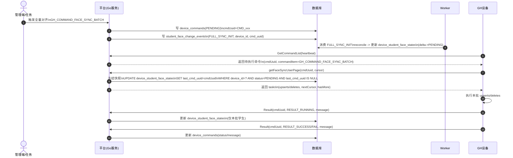
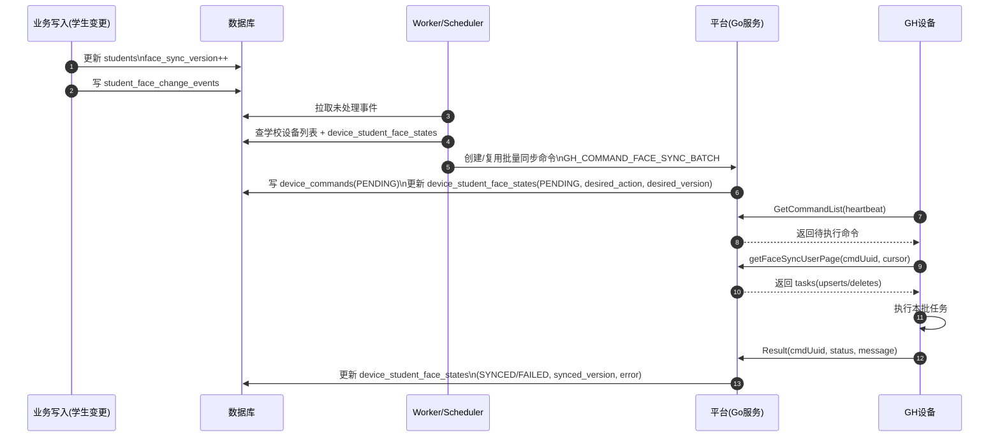
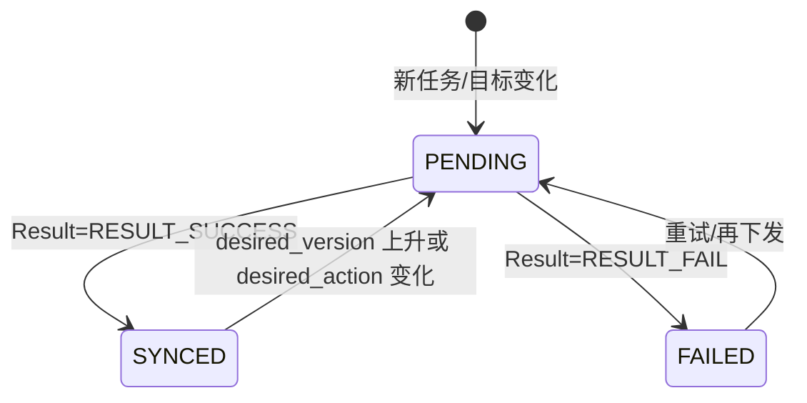

# 人脸下发与增量同步设计（GH 话机）

## 背景

目前人脸下发以“全量同步”为主。甲方需要：

- 查看某台设备上“有哪些学生的人脸信息”
- 能定位“缺少哪些学生 / 为什么没同步上去”
- 支持增量下发：APK 端提交人脸、后台修改用户信息后，自动触发同步到其他设备

本设计的目标是：在不破坏现有命令下发链路的前提下，补齐“可记录、可追溯、可查询”的平台侧数据与增量机制。

## 模式切换（第三方代理 -> 平台直连设备）

历史上我们更多是“平台与第三方系统打交道”，由第三方负责把人脸推到设备、再回写结果；现在调整为“平台自己直接和设备打交道”，第三方不再承担核心同步执行职责（最多作为外部调用方触发同步/查询状态）。

两种模式的关键差异：

| 模式               | 谁和设备交互              | 谁负责落库“设备已有哪些人脸”       | 我们是否依赖第三方字段/回写        |
| ------------------ | ------------------------- | ---------------------------------- | ---------------------------------- |
| 第三方代理（旧）   | 第三方                    | 第三方回写后平台落库               | 强依赖（字段多、口径不一致风险高） |
| 平台直连设备（新） | 平台（命令下发/回执处理） | 平台（基于设备 Result / 对账能力） | 不依赖（仅保留平台/设备必需字段）  |

因此新方案里“第三方上报同步结果”的大字段 payload（例如逐人 items 列表、第三方任务ID等）都不再是必需项；平台以设备侧 `Result(cmdUuid)` 回执与对账能力作为唯一事实来源。

## 现状梳理（项目已有逻辑）

这一节用于避免遗漏历史行为，尤其是 `downloadUserFlag`、全量/增量两套链路的差异。

### 1) 设备配置 downloadUserFlag 的作用

- 字段来源：
  - `internal/model/device_config.go`：`DownloadUserFlag`（默认 `Y`），注释“是否全量同步人脸：Y/N”
  - `internal/model/device.go`：设备表也有 `DownloadUserFlag`
- 下发方式：
  - `internal/service/gh_device.go` 的 `GetSystemConfig` 会把 `downloadUserFlag` 回传给设备（`resp.DownloadUserFlag = string(config.DownloadUserFlag)`）
- 关键点：
  - 后端当前只负责“把开关值返回给设备”，并不直接根据该开关在后端创建同步命令。
  - `downloadUserFlag` 不是“命令码开关”。它不会自动变成某个 `GH_COMMAND_*` 命令；是否产生全量同步命令取决于平台是否创建命令记录。
  - 如果设备端固件把 `downloadUserFlag=Y` 解释为“自行触发全量拉取人员/照片”，那么这条同步链路平台侧可能没有 cmdUuid 结果闭环（不可追溯）。

### 2) 历史全量同步（两种形态）

#### A. 配置驱动的全量（设备自发）

典型表现：

- 设备读取系统配置拿到 `downloadUserFlag=Y`
- 设备侧可能主动调用人员接口完成全量拉取：
  - `GetGhUserCount` / `GetGhUserList`（分页拉取）
  - `GhUser` 结构包含 `fileUrl/fileName`（照片信息）
    局限：
- 平台侧没有“命令记录 + 结果回调”，因此无法准确回答“某设备上有哪些学生/缺谁/原因”。

#### B. 命令驱动的全量（平台可控）

已有命令码（项目已存在）：

- `GH_COMMAND_SEND_USER_FACE_ALL`（旧版）
- `GH_COMMAND_SEND_USER_FACE_ALL2`（新版）
  链路：
- 平台创建全量同步命令（当前代码主用 `GH_COMMAND_SEND_USER_FACE_ALL2`；本方案新 APK 主链路改为 `GH_COMMAND_FACE_SYNC_BATCH`，旧命令保留作兼容/兜底）
- 设备心跳接口获取待执行命令列表：`internal/service/gh_device.go` 的 `GetCommandList`
- 设备执行后回调 `Result`（带 `cmdUuid/status/message`）：`internal/schema/open/gh_device.go` 的 `GhDeviceResultReq`
  当前已有的后处理：
- `internal/service/device_command.go` 在 `ProcessCommandResult` 中对全量命令的 `message` 做解析（提取“无照片/无效人脸”等），并更新学生的 `face_status`（全局维度）
  局限：
- 当前处理落在“学生全局 face_status”，不是“设备-学生”的同步状态，因此仍无法满足甲方“按设备查看有哪些学生已同步/缺失原因”的需求。

### 3) 历史增量同步（单人新增/更新/删除）

已有命令码（项目已存在）：

- `GH_COMMAND_ADD_ONE_USER_FACE`（新增单人）
- `GH_COMMAND_UPDATE_ONE_USER_FACE`（更新单人）
- `GH_COMMAND_DELETE_ONE_USER_FACE`（删除单人）
  链路：
- 平台创建命令时会把学生ID写入 `requestData.arg`（设备侧通过 `GetCommandList` 拿到 `arg`）
- 管理端已有批量入口：`POST /admin/students/device-control`
  - `internal/service/admin_student.go` 会对学校下所有设备批量创建单人命令（add/update/delete）
    当前状态：
- 单人增量的 Result 解析与状态落库不完整（`ProcessCommandResult` 中单人处理逻辑目前是注释掉的），导致“单人下发的成功/失败原因”平台侧同样不可追溯。

### 4) 全量 vs 增量的核心差异（现状角度）

- 触发方式：
  - 全量：可能由设备配置 `downloadUserFlag=Y` 自发触发（不可追溯）；也可能由平台创建全量命令触发（可追溯）
  - 增量：只能由平台创建带学生ID的单人命令触发（理论上可追溯，但目前缺少落库）
- 平台可观测性：
  - “命令驱动”链路具备 cmdUuid 和 Result 回调，适合作为可追溯事实来源
  - “配置驱动”链路若不走命令/回调，将导致平台状态与设备真实状态可能不一致

## 范围

- 设备类型：现有 GH 设备协议（设备心跳拉取命令列表；设备回调命令执行结果）。
- 新增命令码：`GH_COMMAND_FACE_SYNC_BATCH`（设备通过新 operation 分页拉取“任务视图”，完成批量 upsert/delete）。
- 兼容保留：历史命令码（如 `GH_COMMAND_SEND_USER_FACE_ALL2` / 单人增量 `ADD/UPDATE/DELETE`）仍可保留作兜底/回滚路径，但不作为新 APK 主链路。

## 命名约定（数据库 / API / 领域对象）

### 数据库表

- `device_student_face_states`：设备-学生维度的人脸同步状态（事实态快照）
- `student_face_change_events`：学生人脸变更事件（Outbox，用于自动触发增量下发）

### 版本号

- `students.face_sync_version`（BIGINT）：凡是会影响设备侧人脸/人员信息展示的变更，都自增该版本号。

### 状态/枚举

- `device_student_face_states.desired_action`：
  - `UPSERT`：期望设备侧存在该学生（人脸/人员信息需要新增或更新）
  - `DELETE`：期望设备侧删除该学生（从设备侧移除/不可用）

- `device_student_face_states.status`：
  - `PENDING`：待处理（等待设备拉取并执行）
  - `SYNCED`：已处理成功
  - `FAILED`：处理失败（带失败原因）

- `student_face_change_events.change_type`：
  - `FACE_UPSERT`：人脸新增/更新
  - `FACE_DELETE`：人脸删除/失效
  - `USER_INFO_UPDATE`：与设备侧人员信息相关的字段更新
  - `FULL_SYNC_INIT`：全量同步初始化任务（用于异步预写 `device_student_face_states`；仅该类型使用 `device_id/cmd_uuid`）

### 失败原因码（建议）

- `NO_PHOTO`：学生没有可用的人脸照片
- `INVALID_FACE`：有人脸照片但设备识别为无效人脸
- `DEVICE_ERROR`：设备执行失败（message 透传）

### 标识符约定（必须统一口径）

本方案涉及三类标识符，必须在平台/设备两端统一，否则设备回告的 `successUuids/failedUuids` 无法准确落库并映射到学生。

约定强调：平台不负责做人脸识别/比对；`userUuid` 是设备侧“人员主键”（人脸入库/识别命中都用它）。平台只负责按 `userUuid` 下发照片/人员信息，并按 `userUuid` 记录同步事实与失败原因。

- `studentId`：平台内学生主键（`students.id`）
- `deviceId`：平台内设备主键（`devices.id`）
- `userUuid`：GH 设备侧“人员唯一标识”（出现在 `successUuids/failedUuids`、digest/list 等场景）

约定（推荐默认）：**平台直接将 `students.id` 的 string 作为 `userUuid` 下发给设备**（即 `userUuid == studentId(string)`）。

如果历史原因无法做到 `userUuid == studentId`：

- 必须提供稳定映射（例如平台侧新增 `student_gh_user_uuid` 字段，或维护映射表），并在“命令下发 payload / Result 回告 / 对账 list / 按 uuid 查询学生信息”里使用同一套 `userUuid`。

## 数据模型

### 1) students（已有表）

新增字段：

- `face_sync_version BIGINT NOT NULL DEFAULT 0`

需要触发 `face_sync_version++` 的典型场景：

- APK 上传/更新人脸：`face_image_url` / `face_feature` / `face_status`
- 后台更新影响设备侧展示/识别的字段：如 `name`、`card_no`（以 GH 下发 payload 实际使用字段为准）
- 删除/禁用学生（需要设备侧删除或不可用）

#### students.face_status 的定位（与设备同步状态解耦）

`students.face_status`（以及相关人脸字段）建议只表达“平台侧人脸资料本身是否可用”的全局状态，例如：

- 是否已采集/是否有照片
- 是否审核通过/是否不合格
- 是否已生成特征等

`students.face_status` 不应再被用于表达“同步到某台设备是否成功/失败”，设备维度的同步结果应落在 `device_student_face_states`。

实现备注（写代码时需注意）：

- 当前项目中存在“根据设备全量同步回告 message 更新学生 face_status”的逻辑（`internal/service/device_command.go` 的 `processFaceRecognitionResult`）。
- 新方案落地时，应避免用“某台设备同步失败原因”去覆盖学生全局人脸状态，以免出现误判（例如设备异常导致失败，但学生人脸资料本身是正常的）。
  - 建议将该类失败原因落到 `device_student_face_states.last_error_code/last_error_msg`。

### 2) device_student_face_states（新增表）

用途：支撑"某设备有哪些学生的人脸/缺谁/为何缺"的后台可观测，同时作为 **人脸同步任务视图** 供设备拉取。

最小字段（建议）：

- `id`
- `tenant_id`, `school_id`
- `device_id`
- `student_id`
- `desired_action`：期望动作（`UPSERT` | `DELETE`）
- `desired_version`：平台期望下发到设备的版本
- `synced_version`：设备最后一次确认成功的版本
- `status`：`PENDING|SYNCED|FAILED`
- `last_cmd_uuid`：最近一次绑定/执行该行任务的 `cmdUuid`（用于快照冻结 + 排障）
- `last_command_item`：命令码（全量/单人增量）
- `last_error_code`, `last_error_msg`
- `retry_count`：重试次数
- `last_synced_at`
- `created_at`, `updated_at`

索引：

- 唯一索引：(`device_id`, `student_id`)
- 命令快照查询（分页拉取任务）：(`device_id`, `last_cmd_uuid`, `status`, `id`)
- 设备待处理查询：(`device_id`, `status`, `id`)
- 查询索引：(`tenant_id`, `school_id`, `device_id`, `status`, `id`)

#### desired_action 字段说明

- `UPSERT`：需要同步人脸到设备（新增或更新）
- `DELETE`：需要从设备删除人脸

删除触发来源：

- 学生被删除/停用/转学/离开设备作用域 → 写 `FACE_DELETE` 事件 → Worker 把对应 state 置为 `desired_action=DELETE, status=PENDING`
- 全量对齐（`FULL_SYNC_INIT`）→ Worker 做 reconcile，把"设备应有名单"以外的历史 state 也置为 `DELETE` + `PENDING`

#### desired_version / synced_version 的存在意义

这两个字段用于把“期望状态”和“已确认状态”分离开，解决增量同步与排障中的核心问题：

- 增量判断：
  - `desired_version > synced_version` 代表“该设备对该学生还没同步到最新”，需要下发 `ADD/UPDATE`。
  - 没有版本对比的话，要么只能“每次都发”（重复下发、成本高），要么只能“凭时间猜”（不可靠）。

- 可解释的同步状态：
  - `status=PENDING` 且 `desired_version > synced_version`：命令已创建但设备尚未确认（可能离线/队列积压）。
  - `status=FAILED`：设备已回调失败，可结合 `last_error_code/last_error_msg` 给出原因。

- 重试/幂等/补偿：
  - 当 `desired_version` 不变且 `synced_version` 未追平时，可以安全重试同类命令（有明确依据）。
  - 执行一次全量同步后，可以把 `synced_version` 追平到 `desired_version`，作为新的基线，后续再走增量。

- 避免并发更新导致回滚（乱序回调保护）：
  - 学生短时间内多次更新版本 10->11->12，设备回调可能乱序到达。
  - 通过 `synced_version = max(synced_version, 回调版本)` 可避免旧回调把状态覆盖回旧版本。

### 3) student_face_change_events（新增表）

用途：把“APK/后台改动”统一沉淀为事件，后台任务消费事件自动生成增量命令，避免依赖前端手工触发。

#### 复用同一张表承载“全量初始化任务”（推荐）

为实现“全量命令创建快 + PENDING 可查 + 不丢数据”，建议复用 `student_face_change_events` 承载全量同步的 init job：

- 新增 `change_type=FULL_SYNC_INIT`
- 新增可空字段 `device_id`（仅 FULL_SYNC_INIT 使用；增量事件为 NULL）
- （建议）新增可空字段 `cmd_uuid`（用于把 init job 与某次全量命令关联，便于排障/重放）

这样 Worker 的消费逻辑可以统一：

- `FULL_SYNC_INIT`：按 `device_id + school_id` 分页扫描学生，批量 upsert `device_student_face_states`：
  - 全量更新/补齐 `desired_version=students.face_sync_version`
  - 仅对需要追平的行标记 `status=PENDING`（无记录 / `synced_version < desired_version` / `status != SYNCED`），并写入 `last_command_item`（`last_cmd_uuid` 保持 NULL，等 `getFaceSyncUserPage` 首次调用冻结快照）
- 其他 change_type（FACE_UPSERT / FACE_DELETE / USER_INFO_UPDATE）：按 `student_id + school_id` 查设备列表并创建单人命令

索引建议补充：

- 未处理事件扫描（推荐用 partial index）：`(created_at, id) WHERE processed_at IS NULL`
- FULL_SYNC_INIT 扫描（partial index）：`(device_id, created_at, id) WHERE processed_at IS NULL AND change_type='FULL_SYNC_INIT'`
- 排查用：`(student_id, created_at DESC)`

#### 事件保留还是删除？

建议 **保留**，用 `processed_at` 标记已处理（并保留 `retry_count/last_error`），原因：

- 可审计：能追溯“某学生什么时候触发过同步、触发原因是什么、是否处理成功”
- 可重放：需要时把 `processed_at` 置空（或新增 `replay_at`）即可重新消费
- 可排障：失败事件可长期保留，方便定位“为什么没下发/没成功”

建议加一个清理策略（避免无限增长）：

- `processed_at` 非空且创建时间超过 N 天（如 30/90 天）可归档或删除

#### 事件粒度（推荐方案）

推荐方案A：**一条事件 = 一个学生变更**（`student_id + change_type + new_version`）。

- Worker 在消费时按 `school_id` 查询该校设备列表，然后对每台设备创建命令并更新 `device_student_face_states`
- 优点：事件表体积小、易重放；设备粒度的执行事实由 `device_student_face_states` 承担（本来就需要它）

不推荐方案B：一条事件绑定到一个设备（`student_id + device_id + change_type`）。

- 事件量会膨胀为 `学生变更数 × 设备数`，存储/重放/排障成本都更高

#### Worker 运行方式（推荐）

项目当前 `cmd/main.go` 已内置两套后台机制：

- `internal/scheduler`：带 Redis 分布式锁的调度器（适合“全局唯一”的后台任务）
- `internal/task`：进程内定时任务（在多实例部署时可能会重复执行）

**推荐（最少改动）**：延续 `internal/task` 的实现方式（Start/Stop + goroutine + ticker），但在每次执行前加 `internal/scheduler` 的分布式锁。

原因：

- 仓库里已有任务实践是放在 `internal/task`（`cmd/main.go` 启动 `taskManager.StartAll()`）。
- 部分任务已经在 `internal/task` 内使用 `scheduler.NewDistributedLock(...)`（例如 `internal/task/device_base_status_sync.go`），说明“task + 分布式锁”的组合是现有可用模式。
- 这样不需要新增独立 worker 进程，也不需要把 outbox 逻辑强行塞进 `internal/scheduler` 的专用结构里。

落地建议：

- 新增 `internal/task/face_sync_outbox_task.go`
- 在 `execute()` 里抢锁（例如 lockName=`face_sync_outbox`），抢到才消费 `student_face_change_events`
- 在 `internal/task/task_manager.go` 注册并启动该任务

可选方案（后续再做）：

- 新增 `cmd/worker`（或 `cmd/tools/face_sync_worker`）作为独立进程运行；适合需要独立扩缩容或避免影响 API 延迟的场景

最小字段（建议）：

- `id`
- `tenant_id`, `school_id`
- `student_id`
- `change_type`
- `new_version`
- `processed_at`（NULL 表示未处理）
- `retry_count`, `last_error`
- `created_at`, `updated_at`

索引：

- 待消费扫描（推荐用 partial index）：`(created_at, id) WHERE processed_at IS NULL`
- FULL_SYNC_INIT 扫描（partial index）：`(device_id, created_at, id) WHERE processed_at IS NULL AND change_type='FULL_SYNC_INIT'`
- 排查用：`(student_id, created_at DESC)`

### 4) Postgres DDL（可直接落库）

仓库已补齐可重复执行的 Postgres DDL 脚本：`scripts/sql/add_face_sync_tables.sql`。

```sql
-- Postgres DDL for GH face sync (task-view + outbox)
-- Safe to run multiple times (uses IF NOT EXISTS where possible).

-- 1) students: add face_sync_version
ALTER TABLE IF EXISTS students
  ADD COLUMN IF NOT EXISTS face_sync_version BIGINT NOT NULL DEFAULT 0;

-- 2) device_student_face_states: per-device per-student materialized task view / fact table
CREATE TABLE IF NOT EXISTS device_student_face_states (
  id BIGSERIAL PRIMARY KEY,
  tenant_id BIGINT NOT NULL,
  school_id BIGINT NOT NULL,
  device_id BIGINT NOT NULL,
  student_id BIGINT NOT NULL,

  desired_action VARCHAR(10) NOT NULL,
  desired_version BIGINT NOT NULL DEFAULT 0,
  synced_version BIGINT NOT NULL DEFAULT 0,
  status VARCHAR(10) NOT NULL DEFAULT 'PENDING',

  last_cmd_uuid VARCHAR(64),
  last_command_item VARCHAR(100),
  last_error_code VARCHAR(64),
  last_error_msg VARCHAR(500),
  retry_count INTEGER NOT NULL DEFAULT 0,
  last_synced_at TIMESTAMPTZ,

  created_at TIMESTAMPTZ NOT NULL DEFAULT now(),
  updated_at TIMESTAMPTZ NOT NULL DEFAULT now(),

  CONSTRAINT chk_device_student_face_states_desired_action
    CHECK (desired_action IN ('UPSERT', 'DELETE')),
  CONSTRAINT chk_device_student_face_states_status
    CHECK (status IN ('PENDING', 'SYNCED', 'FAILED'))
);

CREATE UNIQUE INDEX IF NOT EXISTS uq_device_student_face_states_device_student
  ON device_student_face_states(device_id, student_id);

-- Task paging for getFaceSyncUserPage: device_id + cmd snapshot + status + cursor(id)
CREATE INDEX IF NOT EXISTS idx_device_student_face_states_task_page
  ON device_student_face_states(device_id, last_cmd_uuid, status, id);

-- Admin queries / worker scans
CREATE INDEX IF NOT EXISTS idx_device_student_face_states_device_status
  ON device_student_face_states(device_id, status, id);

CREATE INDEX IF NOT EXISTS idx_device_student_face_states_tenant_school_device_status
  ON device_student_face_states(tenant_id, school_id, device_id, status, id);

-- 3) student_face_change_events: outbox / driver table
CREATE TABLE IF NOT EXISTS student_face_change_events (
  id BIGSERIAL PRIMARY KEY,
  tenant_id BIGINT NOT NULL,
  school_id BIGINT NOT NULL,

  student_id BIGINT,
  change_type VARCHAR(32) NOT NULL,
  new_version BIGINT,

  -- only used by FULL_SYNC_INIT
  device_id BIGINT,
  cmd_uuid VARCHAR(64),

  processed_at TIMESTAMPTZ,
  retry_count INTEGER NOT NULL DEFAULT 0,
  last_error TEXT,

  created_at TIMESTAMPTZ NOT NULL DEFAULT now(),
  updated_at TIMESTAMPTZ NOT NULL DEFAULT now(),

  CONSTRAINT chk_student_face_change_events_change_type
    CHECK (change_type IN ('FACE_UPSERT', 'FACE_DELETE', 'USER_INFO_UPDATE', 'FULL_SYNC_INIT')),
  CONSTRAINT chk_student_face_change_events_scope
    CHECK (
      (change_type = 'FULL_SYNC_INIT' AND student_id IS NULL AND device_id IS NOT NULL AND cmd_uuid IS NOT NULL AND new_version IS NULL)
      OR
      (change_type <> 'FULL_SYNC_INIT' AND student_id IS NOT NULL AND device_id IS NULL AND cmd_uuid IS NULL AND new_version IS NOT NULL)
    )
);

-- Unprocessed scan (hot path): WHERE processed_at IS NULL ORDER BY created_at,id LIMIT N
CREATE INDEX IF NOT EXISTS idx_student_face_change_events_unprocessed
  ON student_face_change_events(created_at, id)
  WHERE processed_at IS NULL;

-- FULL_SYNC_INIT scan per device
CREATE INDEX IF NOT EXISTS idx_student_face_change_events_full_sync_init
  ON student_face_change_events(device_id, created_at, id)
  WHERE processed_at IS NULL AND change_type = 'FULL_SYNC_INIT';

-- Debug / audit
CREATE INDEX IF NOT EXISTS idx_student_face_change_events_student_created_at
  ON student_face_change_events(student_id, created_at DESC);
```

## 关键工程问题与策略（必须明确）

### 1) 增量事件去重/合并（同一学生短时间多次更新）

场景：同一学生在很短时间内多次变更（例如 1 秒内多次改名/改卡号），会产生多条 `USER_INFO_UPDATE` 事件。

约定：**Worker 消费阶段做合并**，按 `(tenant_id, school_id, student_id)` 聚合，只对“最新版本”创建命令。

合并规则（建议）：

- 以 `new_version` 最大（或 `created_at` 最新）的一条事件为准，其它事件在同一轮消费中标记为“已合并处理”（`processed_at=now`，可在 `last_error` 写入 `MERGED_TO:<eventId>` 便于审计）。
- `change_type` 优先级建议：`FACE_DELETE` > `FACE_UPSERT` > `USER_INFO_UPDATE`（同一学生多事件时，以优先级最高的动作决定命令类型）。

### 2) 设备离线导致命令积压（同一学生 N 次更新）

场景：设备离线 3 天，同一学生被更新 10 次。

约定：平台侧尽量做到“**一段时间内最多下发 1 条有效命令**”，避免设备上线后重复执行。

推荐策略（组合拳，按实现难度从低到高）：

- **优先做事件合并**（见上一节）：把多次变更合并成一次“追到最新版本”的增量下发。
- **命令幂等约束**：增量命令（ADD/UPDATE/DELETE）只携带 `studentId`，设备执行时必须拉取平台最新数据并落库（即：同一学生重复执行 UPDATE，不会导致错误，只是浪费）。
- **平台侧抑制重复命令（可选增强）**：创建命令前查询 `device_student_face_states`：
  - 若该设备该学生已存在 `status=PENDING` 且 `last_cmd_uuid` 仍未完结，则本轮不再创建新命令（仅保留“最新事件”待下一轮再尝试），避免 `device_commands` 队列膨胀。

说明：

- 如果设备侧无法做到“按 studentId 拉取最新数据执行”，则不建议做“抑制重复命令”，只能接受队列浪费或改为“命令携带版本/快照”方案（复杂度显著上升）。

### 3) `face_sync_version` 自增入口分散（高风险点）

风险：如果某个业务入口忘记 `face_sync_version++` 或忘记写 outbox，会导致增量同步不触发。

约定：**必须在 Store/Repo 层提供统一入口**，业务层不允许自行拼装“自增 + 写事件”。

推荐落地方式：

- 在 `student_store`（或 `student_repo`）提供类似 `TouchFaceSync(ctx, studentId, changeType)` 的方法：
  - 事务内：`UPDATE students SET face_sync_version=face_sync_version+1 ...` 并返回 `new_version`
  - 事务内：插入 `student_face_change_events(student_id, change_type, new_version, ...)`
- 业务入口只做“是否影响设备侧”的判断，然后调用上述统一方法（减少遗漏）。

### 4) 全量同步时 Result 回调先于 init job 完成（竞态）

场景：创建全量命令并写入 `FULL_SYNC_INIT` 事件后，设备执行很快，`Result` 回调先到；此时状态表还没被 init job 预写。

约定：`ProcessCommandResult` 必须可在“状态表缺行”时工作：**按回告的 uuid 列表做 upsert**，不依赖 init job 的先后顺序。

写入策略（推荐）：

- 对 `successUuids/failedUuids` 中出现的学生：直接 upsert `device_student_face_states`：
  - `status=SYNCED/FAILED`
  - `synced_version`：取 `students.face_sync_version`（以回调时刻为准）
  - `desired_version`：若记录不存在，初始化为与 `synced_version` 相同（保证一致性）；后续若学生再发生变更，由增量事件把 `desired_version` 推高并触发补齐。

说明：

- 这个策略选择“最终一致性”：全量同步过程中如果学生又发生变更，会由 outbox 增量命令追平，不要求“全量一次性完全覆盖到某个快照版本”。

### 5) 对账机制（digest/list）的触发时机

约定：对账能力用于"发现漂移并修复"，默认不作为主链路，但需要明确触发策略，避免只停留在"可选"。

建议触发策略（推荐默认）：

- 自动：全量同步命令最终 `SUCCESS/FAILED` 收口后，自动触发一次 `GET_USER_FACE_DIGEST`（轻量自证）。
- 定时：每天/每周定时抽样或全量对账（优先对"长期离线/失败率高/最近发生学校切换"的设备）。
- 手动：管理员接口支持多设备批量触发：
  - `POST /admin/face-sync/reconcile`：批量触发对账
  - 请求体：`{"deviceIds": [1,2,3]}` 或 `{"tagId": 123}`（按标签批量）
  - 后端遍历设备列表，为每台设备创建 `GET_USER_FACE_DIGEST` 命令

### 6) APK Result `message` 协议兼容（新旧版本共存）

约定：平台侧必须兼容新旧两种 message 格式，避免灰度期“解析失败导致状态丢失”。

兼容策略：

- **优先按 JSON 解析**（推荐字段：`successUuids/failedUuids/batchNo/processed/total/...`）
- JSON 解析失败时：回退到历史解析逻辑（例如你们现有的 `parseFaceRecognitionMessage`）
- 解析失败必须打点/告警（含 `cmdUuid/deviceId/commandItem`），便于推动设备侧升级与口径收敛

### 7) 全量同步是否必须“下载全部”？（任务视图驱动的全量对齐）

结论：不需要。新 APK 走“任务视图”主链路：平台先把“设备需要做什么（upsert/delete 哪些学生）”物化到 `device_student_face_states`，设备只分页拉取待处理任务并执行。

核心点：

- 全量对齐（reconcile）在平台侧完成“应有清单”的计算：`FULL_SYNC_INIT` 扫描新学校学生并更新 `desired_action/desired_version`，仅对“需要追平”的行标记 `PENDING`。
- 设备侧不再需要拉取“全校人员清单”；只需要调用 `getFaceSyncUserPage` 获取本设备的待处理任务（upserts + deletes）。
- 任务中携带 `faceSyncVersion`（= `students.face_sync_version`）用于解释“为什么要更新”，并可用于乱序回告保护（`synced_version = max(...)`）。

### 8) 快照冻结与命令生命周期边界规则（必须明确）

本节用于解决“cmdUuid 复用/快照冻结/游标分页”在工程实现中的边界冲突，确保不会漏同步、不会卡死。

#### A. 命令复用规则（必须明确）

只允许复用 `device_commands.status='PENDING'` 的命令（设备尚未开始拉页，快照未冻结）：

| device_commands.status | 是否允许复用 | 说明                                                   |
| ---------------------- | ------------ | ------------------------------------------------------ |
| PENDING                | 允许         | 设备尚未调用 `getFaceSyncUserPage`，可以继续合并新任务 |
| RUNNING                | 禁止         | 快照已冻结；新任务必须等下一条 cmdUuid                 |
| SUCCESS/FAILED/EXPIRED | 不适用       | 命令已收口，必须创建新命令                             |

实现要点：

- Worker 创建/复用命令时，仅查询 `command_item=GH_COMMAND_FACE_SYNC_BATCH AND status='PENDING'`
- `getFaceSyncUserPage` **首次冻结快照成功后**，平台应把 `device_commands.status` 置为 `RUNNING`（避免后续误复用/误合并）

#### B. 命令收口时的“冻结行释放”机制（必须实现）

当 `device_commands.status` 变为 `SUCCESS/FAILED/EXPIRED` 时，必须释放“被冻结但未处理完”的行，否则可能永久卡死：

```sql
UPDATE device_student_face_states
SET last_cmd_uuid = NULL, updated_at = now()
WHERE device_id = ?
  AND last_cmd_uuid = ?
  AND status = 'PENDING';
```

触发时机：

- `ProcessCommandResult` 收到 `RESULT_SUCCESS/RESULT_FAIL`（命令收口）
- 命令超时清理任务（如有）把命令标记为 `EXPIRED`

#### C. RUNNING 会话期间遇到新版本/新动作：强制解绑（避免漏同步）

如果某行已被某会话冻结（`last_cmd_uuid IS NOT NULL`），但增量事件又把它的 `desired_version/desired_action` 推高：

- 必须强制解绑：`last_cmd_uuid=NULL`
- 保持/设置为待处理：`status='PENDING'`
- 让它进入**下一条 cmdUuid** 的会话，避免“已翻页错过导致新版本漏同步”

建议落库口径（示例）：

```sql
INSERT INTO device_student_face_states (...)
VALUES (...)
ON CONFLICT (device_id, student_id) DO UPDATE SET
  desired_version = EXCLUDED.desired_version,
  desired_action  = EXCLUDED.desired_action,
  status          = 'PENDING',
  last_cmd_uuid   = NULL,
  updated_at      = now();
```

说明：

- 代价：同一学生可能在两次会话中都被处理
- 收益：保证“不漏新版本”，设备侧按 `studentId` 幂等执行即可

#### D. getFaceSyncUserPage 的 upserts 字段边界（推荐方案 A：一次返回全量字段）

为覆盖 `USER_INFO_UPDATE`（改名/改卡号等），建议 `getFaceSyncUserPage.upserts[]` 返回设备侧需要的完整字段（避免二次拉取）：

- 必选：`userUuid`, `faceSyncVersion`, `fileUrl`
- 建议与 `GhUser` 对齐（按 GH 设备侧真实使用字段裁剪）：`userName`, `userCode`, `cardNumber`, `className`, `sex`, `fileName`, `userType`

若设备侧强约束“只能二次拉取”，再退化为方案 B：仅返回 `userUuid + faceSyncVersion`，设备每条 upsert 调用 `getOneUserInfo(userUuid)` 补齐字段（成本更高）。

#### E. “设备应有名单”的精确口径（必须写死 SQL 条件）

为避免 reconcile 反复 PENDING 或误删，必须明确“设备应有名单”的 SQL 过滤条件（以下按当前项目学生表字段口径给出示例）：

```sql
SELECT s.id AS student_id, s.face_image_url
FROM students s
WHERE s.school_id = ?
  AND s.deleted_at IS NULL
  AND s.status = 1;
```

`students.status`（当前项目注释口径）：

- `1`：在读（应纳入“应有名单”）
- `2`：毕业（不纳入）
- `3`：转学（不纳入）
- `0`：停用（不纳入）

#### F. 必须实现的关键动作清单（开发时逐条对照）

以下 3 个动作是快照冻结机制正确工作的原子保证，缺一不可：

| #   | 触发时机                                             | 动作                                                        | 漏掉的后果                                      |
| --- | ---------------------------------------------------- | ----------------------------------------------------------- | ----------------------------------------------- |
| 1   | `getFaceSyncUserPage` 首次调用/首次冻结快照成功后    | `device_commands.status = 'RUNNING'`                        | Worker 继续合并任务到同一 cmdUuid，破坏冻结语义 |
| 2   | 命令收口/过期                                        | 释放 `last_cmd_uuid=NULL`（仅 `status='PENDING'` 的冻结行） | 未处理完的行永久卡死，无法被新命令冻结          |
| 3   | 增量事件写 state（或任何场景把该行重新置为 PENDING） | 强制 `last_cmd_uuid=NULL`                                   | 新版本被旧会话“锁住”，翻页错过后漏同步          |

##### 动作 1：首次调用/冻结后 → 命令置 RUNNING

推荐实现为“CAS 更新”（幂等），避免依赖“freeze 是否影响行数”的判断：

```sql
UPDATE device_commands
SET status = 'RUNNING', updated_at = now()
WHERE cmd_uuid = ?
  AND status = 'PENDING';
```

伪代码（示意）：

```go
// internal/service/gh_device.go - GetFaceSyncUserPage
// 1) 尝试冻结快照（仅冻结 last_cmd_uuid IS NULL 的 PENDING 行）
// 2) 将命令从 PENDING CAS 到 RUNNING（标记会话已开始，禁止后续复用）
// 3) 分页查询 last_cmd_uuid=cmdUuid 的 PENDING 行并返回 tasks
```

##### 动作 2：命令收口/过期 → 释放冻结行

命令最终进入 `SUCCESS/FAILED/EXPIRED` 时，释放“被冻结但未处理完”的行，让它们进入下一条命令会话：

```sql
UPDATE device_student_face_states
SET last_cmd_uuid = NULL
WHERE device_id = ?
  AND last_cmd_uuid = ?
  AND status = 'PENDING';
```

##### 动作 3：增量事件写 state → 强制解绑

增量事件（或任何“把该行重新置为 PENDING”）写入状态表时，必须无条件 `last_cmd_uuid=NULL`：

```sql
INSERT INTO device_student_face_states (...)
VALUES (...)
ON CONFLICT (device_id, student_id) DO UPDATE SET
  desired_version = EXCLUDED.desired_version,
  desired_action  = EXCLUDED.desired_action,
  status          = 'PENDING',
  last_cmd_uuid   = NULL,
  updated_at      = now();
```

## 流程设计

### A) 全量下发（命令：`GH_COMMAND_FACE_SYNC_BATCH`）

1. 管理端触发全量对齐（或设备首次绑定/学校切换后触发一次兜底全量）。
2. 平台创建 `GH_COMMAND_FACE_SYNC_BATCH` 命令（写 `device_commands(PENDING)`，生成 `cmdUuid`）。
3. 同步写入一条 init 事件：`student_face_change_events(change_type=FULL_SYNC_INIT, device_id, cmd_uuid)`，由 Worker 异步预写/更新 `device_student_face_states`：
   - `desired_action`：
     - 学校应有学生：`UPSERT`
     - 历史残留但不在“应有名单”：`DELETE`
   - `desired_version = students.face_sync_version`
   - 仅对 `无记录 / 版本落后 / 上次失败 / 目标动作变化` 的行标记 `status=PENDING`；已是最新的保持 `SYNCED`
4. 设备心跳拉命令：`GetCommandList` 获取 `GH_COMMAND_FACE_SYNC_BATCH(cmdUuid)`
5. 设备执行命令：分页调用 `getFaceSyncUserPage(cmdUuid, cursor, limit)` 拉取任务并执行
6. 设备分批回告 `Result`：
   - `RESULT_RUNNING`：每批只回告本批处理到的学生（允许重复批次幂等）
   - `RESULT_SUCCESS/RESULT_FAIL`：命令收口
7. 平台在 `Result(cmdUuid, ...)` 回调内落库事实态：只更新本批涉及的 `device_student_face_states`

#### 时序图（全量/批量任务视图）



### B) 增量下发（单人新增/更新/删除）

触发来源：

- APK 端提交/更新人脸
- 后台修改学生信息（影响设备侧人员信息）
- 删除/禁用学生（设备侧需要删除）

步骤：

1. 业务更新学生数据，并执行 `students.face_sync_version++`。
2. 插入 `student_face_change_events`（outbox）。
3. Worker/Scheduler 消费待处理事件：
   - 获取该学生所属学校的设备列表
   - 对每台设备 upsert `device_student_face_states`（只更新变更涉及的学生）：
     - `FACE_DELETE`：`desired_action=DELETE`
     - `FACE_UPSERT` / `USER_INFO_UPDATE`：`desired_action=UPSERT`
     - `desired_version=new_version`
     - 若 `无记录` / `synced_version < desired_version` / `desired_action 发生变化` / `status != SYNCED`：标记 `status=PENDING`
   - 为每台设备创建（或复用）一条批量同步命令：`GH_COMMAND_FACE_SYNC_BATCH`
     - 允许对同一设备进行“命令合并”：仅当已有 `PENDING` 的 `GH_COMMAND_FACE_SYNC_BATCH` 时可复用；若已是 `RUNNING`，禁止复用（新任务等待下一条 cmdUuid）
     - 创建/复用命令时，建议写入/更新 `device_student_face_states.last_command_item`

#### 时序图（增量）



#### 状态流转图（device_student_face_states）



- 事件标记 `processed_at`（失败则保留并增加重试信息）

4. 设备回调结果：
   - 成功：更新为 `SYNCED`（`desired_action=DELETE` 的成功删除也落为 `SYNCED`，避免引入额外状态）
   - 失败：更新为 `FAILED` 并记录原因

### C) 设备更换学校（必须触发“清库 + 新学校全量”）

场景：设备从学校 A 调整/迁移到学校 B（绑定学校变化），设备本地人脸库必须切换为学校 B 的全量数据，避免出现“跨校残留人脸”。

#### 触发点

- 当设备的 `schoolId` 发生变化时触发（更新设备/绑定设备组导致的学校变化，最终都归一到“设备当前所属学校变化”）。

#### 平台侧动作（推荐标准流程）

按顺序创建两条命令（同一设备）：

1. 清库命令：`GH_COMMAND_CLEAN_ALL_USER_FACE`
2. 新学校批量同步命令：`GH_COMMAND_FACE_SYNC_BATCH`（配套写入 `FULL_SYNC_INIT` 用于 reconcile）

并同步更新平台侧事实表：

- 对该设备历史的 `device_student_face_states`：
  - 推荐策略：直接删除/归档该设备旧学校的历史行（避免后台仍显示旧校学生）。
- 对新学校学生：
  - 写入 `FULL_SYNC_INIT(device_id, cmd_uuid)`，由 Worker reconcile 新学校“应有名单”并把需要追平的行标记为 `PENDING`；
  - 设备执行 `GH_COMMAND_FACE_SYNC_BATCH` 后，通过 `Result` 回告把状态落库为 `SYNCED/FAILED`。

#### 异常与兜底

- 如果“清库命令失败”，应阻断后续“新学校全量命令”的自动下发（避免混库），并在后台提示需要重试清库。
- 如果设备离线：
  - 命令会处于 `PENDING`；后台需要明确显示“学校已变更，等待设备上线执行清库/全量同步”。
- 如果设备侧支持对账（digest/list）：
  - 在学校切换完成后，建议自动触发一次 `digest` 对账，确认设备人脸库已切换到新学校。

## 人脸同步命令与接口设计

本项目现状已存在“设备心跳拉取命令 + Result 回调”的命令闭环（GH 设备）。本方案在此基础上补齐“可追溯的人脸同步”所需的命令定义、管理端接口与设备回告协议。

### 1) 平台 -> 设备：命令（Command）

#### 新增命令（主链路）

- 批量同步命令：`GH_COMMAND_FACE_SYNC_BATCH`
  - 设备执行方式：分页调用 `getFaceSyncUserPage(cmdUuid, cursor, limit)` 拉取任务（upserts + deletes）并执行

#### 已存在命令（兼容/兜底）

- 全量下发（旧链路）：
  - `GH_COMMAND_SEND_USER_FACE_ALL2`（新版；当前现网可能仍在使用）
  - `GH_COMMAND_SEND_USER_FACE_ALL`（旧版兼容）
- 单人增量下发（旧链路）：
  - `GH_COMMAND_ADD_ONE_USER_FACE`（arg=studentId）
  - `GH_COMMAND_UPDATE_ONE_USER_FACE`（arg=studentId）
  - `GH_COMMAND_DELETE_ONE_USER_FACE`（arg=studentId）
- 设备侧数量查询（已有常量）：
  - `GH_COMMAND_GET_USER_FACE_COUNT`

#### 建议新增命令（用于“对账/自证”）

仅依赖“失败列表推断成功”的方式不够严谨（可能存在部分用户既不在失败列表也未成功写入设备的情况）。为满足“设备如何告知我们它保存了哪些人脸”，建议补齐下面两类命令之一（可按设备固件能力选择）：

1. `GH_COMMAND_GET_USER_FACE_LIST`（查询明细清单）

- 目的：设备返回其本地已保存的人脸人员清单（例如 userUuid 列表）
- 返回：分页或分片返回（避免一次返回过大）
- 平台用途：重建/校验 `device_student_face_states` 的事实态

2. `GH_COMMAND_GET_USER_FACE_DIGEST`（查询摘要/指纹）

- 目的：设备返回“本地人脸数据摘要”，例如：
  - `totalCount`
  - `digest`（基于 userUuid 列表的 hash / rolling hash / bloom filter）
  - `updatedAt`（设备侧最后一次人脸库更新时间）
- 平台用途：快速判断“设备人脸库是否与平台期望一致”，不一致再触发明细对账或全量同步

说明：

- 如果设备侧改造成本较高，优先实现 `GET_USER_FACE_DIGEST`（轻量）+ “不一致时触发全量或分片清单”。

### 2) 设备 -> 平台：回告（Result / Report）

#### A. 命令结果回告（已有接口，必须增强语义）

现有 Result 回调结构为：

- `cmdUuid/status/message`（`internal/schema/open/gh_device.go` 的 `GhDeviceResultReq`）
- `status` 取值约定：`RESULT_SUCCESS` / `RESULT_FAIL`（已有）；`RESULT_RUNNING`（新增，仅用于“分批 Result”的中间态）

为满足“设备自证已保存哪些人脸”的需求，建议对 `message` 的内容协议做标准化（JSON），并在全量/增量命令中统一输出以下字段：

- `successUuids`：本次成功写入设备的人脸 userUuid 列表（或分片返回）
- `failedUuids`：失败的 userUuid 列表 + failureReason（可按 reason 分组）
- `total`：本次处理的总数
- `storedTotal`：设备当前本地人脸库总数（可选）
- `digest`：设备当前人脸库摘要（可选）

这样平台在回调后可以：

- 对单人增量：直接确认该 student 是否写入/删除成功
- 对全量：不再依赖“失败列表反推成功”，可以准确落库事实态

##### 分批 Result（推荐，解决全量数据量过大）

当全量涉及上千/上万人脸时，不建议一次回告带完整 `successUuids`。

推荐做法：同一个 `cmdUuid` 支持多次 `Result` 回告（按批次）。

- `status`：用 `RESULT_RUNNING` 表示进行中；最后一批用 `RESULT_SUCCESS/RESULT_FAIL` 收口
- `message` JSON 增加批次信息（示例）：
  - `batchNo`：从 1 开始
  - `totalBatches`：可选
  - `processed` / `total`：进度
  - `isFinal`：可选（若不想扩展 status，也可用 `isFinal=true` 表示最后一批）
  - `successUuids/failedUuids`：仅包含本批结果

平台侧处理原则：

- **必须幂等（同一 cmdUuid 允许多次回调 / 允许重复批次）**
- 收到 `RESULT_RUNNING`：
  - 不得将 `device_commands` 收口；建议将 `device_commands.status` 从 `PENDING` 更新为 `RUNNING`（不需要 DB 变更，状态字段为 varchar），后续重复 `RESULT_RUNNING` 保持 `RUNNING`
  - 建议设备在开始执行后立即上报第一条 `RESULT_RUNNING`（即使 `processed=0`），用于平台将命令从 `PENDING` 切到 `RUNNING`，避免心跳重复下发
  - 仅更新本批涉及的 `device_student_face_states`（`successUuids/failedUuids` 中出现的学生）；重复批次按 upsert 幂等处理
- 收到 `RESULT_SUCCESS/RESULT_FAIL`（或 `isFinal=true`）：
  - 收口 `device_commands` 为 `SUCCESS/FAILED`
  - 更新本批涉及的 `device_student_face_states`，其余未覆盖的数据交给“对账命令/digest”兜底
- 乱序保护：若 `device_commands` 已是 `SUCCESS/FAILED`，后续再收到 `RESULT_RUNNING` 必须忽略（避免状态回滚）

#### B. 主动上报（可选：定时/事件上报）

为了应对“设备自发全量同步”（`downloadUserFlag=Y`）或设备侧人脸库可能被手工清理/异常丢失等情况，建议增加一条设备主动上报能力（operation 扩展）：

- 新增 operation：`submitFaceSyncState`（名称可调整）
- 请求内容建议：
  - `terminalSn/terminalMac`
  - `storedTotal`
  - `digest`（或 `userUuids` 分片）
  - `reportTime`
- 平台用途：
  - 定期对账：发现 digest 不一致则触发 `GET_USER_FACE_LIST` 或全量命令
  - 在后台页面展示“设备最近一次自报的人脸库规模/时间”

### 3) 平台管理端接口（可新写，不受历史限制）

下面接口用于“触发同步 / 查询结果 / 对账”：

- 触发类：
  - `POST /admin/face-sync/batch`：批量触发同步（支持 deviceIds 或 tagId）
  - `POST /admin/face-sync/reconcile`：批量触发对账（支持 deviceIds 或 tagId）
  - `POST /admin/face-sync/schools/:schoolId/students/:studentId`：对学校下所有设备触发单人增量

- 查询类：
  - `GET /admin/face-sync/devices/:id/states`：设备维度（有哪些/缺谁/原因/版本差）
  - `GET /admin/face-sync/students/:id/states`：学生维度（在哪些设备成功/失败/原因）
  - `GET /admin/face-sync/commands`：人脸同步命令列表（过滤：deviceId/studentId/status/cmdUuid）

#### 手动触发是否走 Outbox？

结论：**手动触发不走 Outbox，直接创建命令（推荐）**。

原因：

- 运营/人工操作的核心诉求是“立即生效”，不应被 Worker 轮询间隔引入额外延迟
- 手动触发通常已经明确了目标范围（单人单设备/单人全校/单设备全量），不需要 outbox 再做“推导目标设备”的工作
- Outbox 的定位是“自动感知变更并可靠触发同步”（可重试/可审计/不丢），手动触发属于另一条链路

约定：

- 手动触发接口直接写 `device_commands`（PENDING）
- 同时同步 upsert `device_student_face_states`（写入/更新 `desired_version`、标记 `PENDING`、更新 `last_command_item`；`last_cmd_uuid` 保持 NULL，等设备首次调用 `getFaceSyncUserPage` 时冻结快照），便于后台立即可查
- 对于“触发全量对齐”的管理端接口（例如 `POST /admin/face-sync/batch` 指定单设备）：同样建议写入 `FULL_SYNC_INIT`（init job）以异步预写入 PENDING 状态，避免接口阻塞

## 设备如何告知“保存了人脸”（对账口径）

为让甲方能在后台看到“设备拥有哪些学生的人脸”，平台侧口径建议统一为：

- 以“命令 Result 回调确认”为主（可追溯事实来源）
- 以“对账命令/主动上报”为辅（发现漂移并修复）

推荐落地顺序（从易到难）：

1. 先增强 Result message 协议：让设备在全量/增量命令回调中带 `successUuids/failedUuids`
2. 加一个轻量 digest 上报/查询：`GET_USER_FACE_DIGEST` 或 `submitFaceSyncState`
3. 需要时再加明细清单：`GET_USER_FACE_LIST`（分页/分片）

## 管理端查询能力（建议接口）

- `GET /admin/face-sync/devices/:id/states`
  - 某设备的人脸同步列表（学生 + 状态 + 原因 + 同步时间 + 版本差）
- `GET /admin/face-sync/students/:id/states`
  - 某学生在各设备的同步状态
- `GET /admin/face-sync/tasks?status=PENDING|FAILED`
  - 待处理/失败看板

兜底操作：

- `POST /admin/face-sync/retry`：按设备/学生重试失败项
- `POST /admin/face-sync/batch`：对设备触发批量同步（重建基线）

## 约束与说明

- GH 协议的人员列表拉取接口不携带 cmdUuid，无法把“拉取行为”与某条命令一一绑定；因此以“命令 Result 回调”为完成信号最可靠。
- 全量同步保留作为漂移修复手段；日常默认走增量同步。

## 建议的兼容/收敛策略（避免状态不一致）

- 推荐将平台侧“可追溯口径”统一到“命令驱动 + Result 回调”链路。
- 对 `downloadUserFlag`：
  - 若设备固件在 `downloadUserFlag=Y` 时会自发全量同步且不回调结果，建议运营上统一设置为 `N`（只允许命令触发），或推动设备侧改造为“即使自发同步也必须回传结果/或由平台发命令”。

### 全量/增量是否依赖配置？（需要特别注意）

项目现状中，“是否全量/是否增量”存在两套来源：

1. 配置驱动（设备侧逻辑）

- `downloadUserFlag=Y`：设备可能会自发走“全量拉取用户列表/照片”的流程（调用 `GetGhUserCount/GetGhUserList`）。
- 该流程不一定对应任何 `GH_COMMAND_SEND_USER_FACE_*` 命令码；平台侧可能没有命令记录/结果回调，因此不可追溯。

2. 命令驱动（平台侧逻辑，推荐作为唯一口径）

- 平台创建命令时才会出现“全量/增量命令码”：
  - 全量（主链路）：`GH_COMMAND_FACE_SYNC_BATCH`（设备分页调用 `getFaceSyncUserPage` 拉取任务视图）
  - 全量（旧链路兼容/回滚）：`GH_COMMAND_SEND_USER_FACE_ALL2`（新版；`...ALL` 仅旧版兼容）
  - 单人增量（兼容/兜底）：`GH_COMMAND_ADD_ONE_USER_FACE` / `...UPDATE...` / `...DELETE...`（arg=studentId）
- 设备通过 `GetCommandList` 拉到命令码并执行，再通过 `Result(cmdUuid)` 回调，平台可追溯。

## 字段收敛（新模式下不再需要“第三方处理字段”）

新模式里同步执行与结果落库都发生在平台侧，因此：

- 平台侧只需要“能定位到设备/命令/学生/版本/结果”的字段（例如：`device_id`、`student_id`、`cmd_uuid`、`desired_version/synced_version`、`status`、`last_error_*`）。
- 不再设计/依赖任何“第三方任务维度”的字段（例如第三方任务ID、第三方逐人同步明细 items、第三方重试计数口径等）；这些会导致口径不一致，且对平台直连设备没有必要。

设备侧只需按既有协议提供：

- 拉命令：`GetCommandList`
- 回执：`Result(cmdUuid, status, message)`（message 建议结构化，便于平台落库与排障）

收敛建议：

- 若目标是“后台准确展示设备保存了哪些学生人脸”，建议把 `downloadUserFlag` 统一配置为 `N`，并以“命令驱动 + Result 回调 + 对账”作为唯一事实来源。

## 设备侧实现说明（给设备/固件对接用）

本章节用于设备侧实现拿来直接对照开发，明确哪些字段/接口是“必须遵循的事实口径”。

### 1) downloadUserFlag（历史字段）在新方案中的定义

- 字段位置：设备调用 `GetSystemConfig` 时响应字段 `downloadUserFlag`
- 新方案约定：
  - `downloadUserFlag` 不再作为“平台人脸同步策略”的依据（不会决定平台发全量/增量命令码）。
  - 设备端应当忽略 `downloadUserFlag` 对“是否同步人脸”的控制作用（推荐），以避免出现设备自发同步导致平台不可追溯的问题。
  - 平台侧推荐默认下发 `downloadUserFlag=N`；若设备端历史逻辑必须读取该字段，也应保证 `Y` 不触发任何“自发全量人脸同步”行为。

### 2) 人脸同步的唯一权威链路：命令驱动 + Result 回调

设备端必须实现并遵循：

- 心跳拉命令：`GetCommandList` 获取待执行命令列表
- 执行命令：按 `commandItem/arg` 执行对应人脸库操作
- 命令回告：调用 `Result` 回传执行结果，且 `cmdUuid` 必须与命令一致

命令约定：

- 批量同步（主链路）：`GH_COMMAND_FACE_SYNC_BATCH`（配套 `getFaceSyncUserPage`）
- 全量（旧链路兼容/回滚）：`GH_COMMAND_SEND_USER_FACE_ALL2`（新版；`...ALL` 仅旧版兼容）
- 单人增量（兼容/兜底）：`GH_COMMAND_ADD_ONE_USER_FACE` / `GH_COMMAND_UPDATE_ONE_USER_FACE` / `GH_COMMAND_DELETE_ONE_USER_FACE`（arg=studentId）
- 对账：按需支持 `GH_COMMAND_GET_USER_FACE_DIGEST` / `GH_COMMAND_GET_USER_FACE_LIST`
- 学校切换：必须先执行 `GH_COMMAND_CLEAN_ALL_USER_FACE`，再执行 `GH_COMMAND_FACE_SYNC_BATCH`（旧固件不支持新链路时才回退 `GH_COMMAND_SEND_USER_FACE_ALL2`）

### 3) Result 回告 message 的协议要求（必须）

为实现“设备告知平台其本地已保存的人脸”，设备端在 `Result.message` 里必须返回结构化 JSON（建议）：

- 全量命令回告：
  - `successUuids`：成功写入设备的人脸 userUuid 列表（可分片/分页）
  - `failedUuids`：失败 userUuid 列表（可按 reason 分组）
  - `storedTotal`：设备当前人脸库总数（可选但建议）
  - `digest`：设备人脸库摘要（可选但建议）
- 单人增量回告：
  - 必须能明确 studentId 对应的人脸“写入/更新/删除是否成功”

#### 平台如何知道“同步了哪些学生/哪些成功失败”？

结论：平台以设备 `Result(cmdUuid, status, message)` 为唯一事实来源；没有 Result 回告（或回告信息不足）就无法可靠判定设备侧实际状态，只能依赖对账能力兜底。

##### 1) 单人增量命令（ADD/UPDATE/DELETE）

单人命令创建时 `requestData.arg=studentId`，平台可以根据 `cmdUuid` 找到对应命令与 `studentId`：

- `status=RESULT_SUCCESS`：该学生在该设备同步成功
- `status=RESULT_FAIL`：该学生在该设备同步失败（建议在 `message` 里带失败原因，便于展示）

示例（设备 -> 平台 Result）：

```json
{
  "cmdUuid": "CMD_xxx",
  "status": "RESULT_FAIL",
  "message": "{\"studentId\":\"123\",\"errorCode\":\"INVALID_FACE\",\"errorMsg\":\"人脸不合法\"}"
}
```

##### 2) 全量同步命令（ALL）

全量命令一次涉及多个学生，平台必须依赖设备在 `message` 里返回“本次处理涉及的学生及其结果”，否则无法落库到 `device_student_face_states`。

推荐分批回告（同一个 cmdUuid，多次 Result）：

- 中间批次：`status=RESULT_RUNNING`（或 `isFinal=false`）
- 最后一批：`status=RESULT_SUCCESS/RESULT_FAIL`（或 `isFinal=true`）用于收口

示例（分批 Result）：

```json
{
  "cmdUuid": "CMD_xxx",
  "status": "RESULT_RUNNING",
  "message": "{\"batchNo\":1,\"processed\":200,\"total\":2000,\"successUuids\":[\"u1\",\"u2\"],\"failedUuids\":[{\"uuid\":\"u3\",\"errorCode\":\"NO_PHOTO\"}]}"
}
```

> 注意：不建议一次 message 返回 2000/10000 个 successUuids，容易超长/超时/解析失败；应按批次返回，或至少返回失败列表并配合对账命令。

如果设备端暂时无法返回 `successUuids`：

- 至少保证返回 `failedUuids` + `storedTotal`，并配合对账命令（digest/list）用于平台重建事实态。

## 同步参数配置（避免 APK 写死）

人脸同步过程中会涉及分页/批次参数（例如拉取学生列表的 pageSize、Result 分批上报的 batchSize）。这些参数如果写死在 APK 内，会导致每次调整都必须发版，运维成本高。

约定：**APK 内保留默认值作为兜底，但优先从平台获取配置**。

### 1) 配置项（建议）

- `faceSyncPageSize`：拉取人脸同步任务分页大小（用于 `getFaceSyncUserPage(cursor, limit)` 的 `limit`）
- `faceSyncResultBatchSize`：设备分批 Result 上报时，每批携带的成功/失败数量上限（避免 message 过大）
- `faceSyncWorkerBatchSize`：平台侧写入 `device_student_face_states` 时的批量 upsert 大小（例如 500，后端配置；不需要下发给设备）

### 2) 下发方式（建议）

优先复用现有的 `GetSystemConfig` 响应，在系统配置里增加“设备侧需要的字段”（不影响旧 APK：旧版本忽略未知字段即可）：

```json
{
  "downloadUserFlag": "N",
  "faceSyncPageSize": 200,
  "faceSyncResultBatchSize": 200
}
```

### 3) 默认值与边界（建议）

- APK 兜底默认：
  - `faceSyncPageSize=200`
  - `faceSyncResultBatchSize=200`
- 平台侧兜底默认：
  - `faceSyncWorkerBatchSize=500`
- 平台侧需要做边界保护（避免配置错误导致极端值）：
  - `faceSyncPageSize` 限制在 `[50, 1000]`
  - `faceSyncResultBatchSize` 限制在 `[50, 500]`

说明：

- 这些配置是“平台可调”，目的是避免 APK 发版；平台调整配置仍需要走配置发布/重启（或走 DB 配置），但不影响设备端版本。

## 实现计划与改动评估

### 设计原则

- 尽量不改动现有逻辑，以新增文件为主
- 新旧逻辑可共存：第三方平台如果不再调用命令接口，现有逻辑不会被触发
- `ProcessCommandResult` 是共用入口，需要增强以支持更新 `device_student_face_states`

### 纯新增文件（不动现有代码）

| 类型       | 文件路径                                            | 说明                             |
| ---------- | --------------------------------------------------- | -------------------------------- |
| Model      | `internal/model/device_student_face_state.go`       | 设备-学生人脸状态表              |
| Model      | `internal/model/student_face_change_event.go`       | 人脸变更事件表（Outbox）         |
| Store      | `internal/store/device_student_face_state_store.go` | 状态表 CRUD                      |
| Store      | `internal/store/student_face_change_event_store.go` | 事件表 CRUD                      |
| Task       | `internal/task/face_sync_outbox_task.go`            | Outbox 消费 Worker               |
| Controller | `internal/controller/admin/face_sync.go`            | 管理端接口（触发同步、查询状态） |
| Migration  | `scripts/sql/add_face_sync_tables.sql`              | 新增两张表 + students 加字段     |

### 必须改动的现有文件

| 文件                                 | 改动点                                                                                                                  | 影响程度 |
| ------------------------------------ | ----------------------------------------------------------------------------------------------------------------------- | -------- |
| `internal/model/student.go`          | 新增 `FaceSyncVersion` 字段                                                                                             | 小       |
| `internal/constant/device.go`        | 新增命令码 `GH_COMMAND_FACE_SYNC_BATCH`（以及 operation 常量，如需）                                                    | 小       |
| `internal/schema/open/gh_device.go`  | 新增 `getFaceSyncUserPage` 请求/响应 schema                                                                             | 小       |
| `internal/service/gh_device.go`      | 新增 `GetFaceSyncUserPage`：按 `device_student_face_states` 输出 upserts/deletes（支持 cmdUuid 冻结快照 + cursor 分页） | 中       |
| `internal/router/open.go`            | 新增 operation 分发到 `GetFaceSyncUserPage`                                                                             | 小       |
| `internal/service/device_command.go` | `ProcessCommandResult` 增加分支，更新 `device_student_face_states`                                                      | 中等     |
| `internal/task/task_manager.go`      | 注册 `face_sync_outbox_task`                                                                                            | 小       |
| `internal/router/admin.go`           | 注册管理端接口                                                                                                          | 小       |

### 新旧逻辑共存说明

```
现有逻辑（第三方）：
  第三方调用 GetCommandList → 执行 → 回调 Result → ProcessCommandResult 处理

新逻辑（自有 APK）：
  APK 调用 GetCommandList → 执行 → 回调 Result → ProcessCommandResult 处理
                                                        ↓
                                              【新增】更新 device_student_face_states
```

- 只需要在 `ProcessCommandResult` 里**增加**一段逻辑（更新新表），不需要删除/修改现有逻辑
- 第三方如果还在用，也不会受影响（只是多写了一张表）

### 触发方式总结

| 触发来源                     | 走 Outbox？ | 说明                                      |
| ---------------------------- | ----------- | ----------------------------------------- |
| APK 端（上传/更新人脸）      | 是          | 自动流程：写事件 → Worker 消费 → 创建命令 |
| 后台业务变更（修改学生信息） | 是          | 自动流程：写事件 → Worker 消费 → 创建命令 |
| 后台管理员手动操作           | 否          | 直接创建命令，立即生效                    |

### 风险评估

| 维度         | 评估                           |
| ------------ | ------------------------------ |
| 新增文件     | 6-7 个文件                     |
| 改动现有代码 | 3-4 处，都是小改动             |
| 风险等级     | 低（新增为主，不破坏现有逻辑） |

## 上线与迁移策略（建议补充）

### 1) 存量设备如何建立基线（首次让“可查”生效）

目标：让 `device_student_face_states` 从第一天就有基线数据，后台能回答“有哪些/缺谁/为何缺”。

推荐流程（按学校/设备分批灰度）：

1. 对目标设备触发一次全量对齐：创建 `GH_COMMAND_FACE_SYNC_BATCH`（并写入 `FULL_SYNC_INIT`）
   （旧链路 `GH_COMMAND_SEND_USER_FACE_ALL2` 仅用于兼容/回滚）
2. 同步写入 `FULL_SYNC_INIT`（带 `device_id/cmd_uuid`）用于异步补齐/更新 `device_student_face_states.desired_version`
3. 设备执行并分批回告 `Result`：
   - 中间批次 `RESULT_RUNNING`：平台仅落库本批提到的学生状态
   - 最后一批 `RESULT_SUCCESS/RESULT_FAIL`：收口命令并补齐最终状态
4. 收口后自动触发一次 `GET_USER_FACE_DIGEST` 自证；若不一致再触发 `GET_USER_FACE_LIST` 重建事实态（可选增强）

补充：

- 若设备发生跨校迁移：必须先执行 `GH_COMMAND_CLEAN_ALL_USER_FACE` 再执行全量对齐（见“设备更换学校”）。

### 2) downloadUserFlag：从 Y -> N 的灰度策略

目标：关闭“设备自发全量同步且不可追溯”的链路，统一到“命令驱动 + Result 回执”。

建议灰度：

- 新设备/新学校：默认下发 `downloadUserFlag=N`
- 存量设备：按 APK 版本/设备批次逐步切换；仅对已升级到“支持命令驱动同步/稳定回告 Result”的版本切换为 `N`
- 回滚兜底：如出现大面积同步异常，可临时恢复 `downloadUserFlag=Y`，但必须接受“不可追溯”的副作用

配置优先级建议保持现状：设备级 > 学校级 > 系统默认（与 `GetSystemConfig` 实现一致）。

### 3) 旧 APK（message 非 JSON）的观测与告警

目的：识别存量设备/版本仍在使用旧 message 协议，避免灰度期“解析失败导致状态丢失”。

建议策略：

- `Result.message` 解析：优先 JSON；失败回退旧解析
- 观测日志：检测到非 JSON 时记录 `WARN`（含 `cmdUuid/deviceId/commandItem/terminalSn/messageLength`），用于统计旧版本占比
- 告警日志：JSON/旧解析都失败时记录 `ERROR`（便于 Sentry 告警），并保留原始 message 片段用于排障

## 前端（管理端 Web）实现说明

本章节描述管理端前端需要实现的页面和交互，便于前端开发对照实现。

### 一、APK 端（设备应用）

APK 端主要负责执行平台下发的命令，并回报执行结果。

#### 1) 核心交互流程

| 流程         | 说明                                                             |
| ------------ | ---------------------------------------------------------------- |
| 心跳拉命令   | 定时调用 `GetCommandList` 获取待执行命令                         |
| 获取同步任务 | 调用 `getFaceSyncUserPage` 获取人脸同步任务（upserts + deletes） |
| 执行命令     | 根据 `commandItem` 执行对应操作（全量/增量/清库/对账）           |
| 回报结果     | 调用 `Result` 接口回传执行结果（支持 `RESULT_RUNNING` 分批回报） |

#### 2) 人脸同步数据获取（新增专用接口）

为保持职责分离、不污染现有人员接口语义，**新增专用人脸同步 operation**：

- `getFaceSyncUserPage`：返回该设备需要处理的人脸变更任务（upserts + deletes），带分页/游标
- `getFaceSyncOneUser`（可选）：单人详情查询

现有人员接口（`getGhUserList` / `getOneUserInfo`）保持不变，继续服务通讯录等功能。

设备侧实际调用路径为 `POST /ghAppController/getData`（按 `operation` 分发）。

##### A. 人脸同步任务拉取（核心接口）

**operation**: `getFaceSyncUserPage`

请求示例：

```json
{
  "operation": "getFaceSyncUserPage",
  "terminalType": "TERMINAL_TYPE_GH_02",
  "terminalSn": "xxx",
  "terminalMac": "xxx",
  "cmdUuid": "CMD_xxx",
  "cursor": 0,
  "limit": 100
}
```

响应结构：

```json
{
  "shrgStatus": "S",
  "shrgMsg": "",
  "upserts": [
    { "userUuid": "123", "fileUrl": "https://...", "faceSyncVersion": 5 },
    { "userUuid": "456", "fileUrl": "https://...", "faceSyncVersion": 3 }
  ],
  "deletes": [{ "userUuid": "789" }],
  "cursor": 150,
  "hasMore": true
}
```

**字段说明**：

| 字段      | 说明                                                                                      |
| --------- | ----------------------------------------------------------------------------------------- |
| `cmdUuid` | 命令ID，用于绑定本次 sync session                                                         |
| `cursor`  | 游标（本质是 `device_student_face_states.id`；请求时传上一次响应返回的 cursor，首次传 0） |
| `limit`   | 每页数量（建议 100）                                                                      |
| `upserts` | 需要同步/更新的学生列表                                                                   |
| `deletes` | 需要删除的学生列表                                                                        |
| `hasMore` | 是否还有更多数据                                                                          |

##### B. 命令与接口绑定机制（快照冻结）

**核心问题**：设备分页拉取期间，后端可能产生新任务，导致游标漂移/重复。

**解决方案**：`cmdUuid` 绑定一次 sync session，冻结快照。

后端实现逻辑：

1. 首次调用时，后端把 PENDING 的 state 行打上 `last_cmd_uuid = cmdUuid`
2. 后续分页只查 `device_id = ? AND last_cmd_uuid = cmdUuid AND status = 'PENDING' AND id > cursor`
3. cursor 稳定、幂等、可重入

```sql
-- 首次调用时冻结快照
UPDATE device_student_face_states
SET last_cmd_uuid = 'CMD_xxx', updated_at = now()
WHERE device_id = ? AND status = 'PENDING' AND last_cmd_uuid IS NULL;

-- 分页查询
SELECT id, student_id, desired_action, desired_version
FROM device_student_face_states
WHERE device_id = ? AND last_cmd_uuid = 'CMD_xxx' AND status = 'PENDING' AND id > ?
ORDER BY id LIMIT 100;
```

#### 3) 命令处理逻辑

| commandItem                       | APK 处理逻辑                                                                                                                                                               |
| --------------------------------- | -------------------------------------------------------------------------------------------------------------------------------------------------------------------------- |
| `GH_COMMAND_FACE_SYNC_BATCH`      | 批量同步：调用 `getFaceSyncUserPage(cmdUuid)` 分页拉取任务 → 处理 upserts（下载人脸）+ deletes（删除本地）→ 分批回报 `RESULT_RUNNING` → 全部完成回报 `RESULT_SUCCESS/FAIL` |
| `GH_COMMAND_CLEAN_ALL_USER_FACE`  | 清库：清空本地人脸库 → 回报 Result                                                                                                                                         |
| `GH_COMMAND_GET_USER_FACE_DIGEST` | 对账：计算本地人脸库摘要 → 回报 Result                                                                                                                                     |

#### 4) Result 回报格式要求

**批量同步命令（分批回报）**：

处理中（每批回报）：

```json
{
  "cmdUuid": "CMD_xxx",
  "status": "RESULT_RUNNING",
  "message": "{\"batchNo\":1,\"processed\":100,\"successUuids\":[\"u1\",\"u2\"],\"failedUuids\":[{\"uuid\":\"u3\",\"errorCode\":\"NO_PHOTO\"}]}"
}
```

最后一批（全部完成）：

```json
{
  "cmdUuid": "CMD_xxx",
  "status": "RESULT_SUCCESS",
  "message": "{\"batchNo\":10,\"processed\":1000,\"isFinal\":true,\"successUuids\":[\"u999\",\"u1000\"],\"failedUuids\":[],\"storedTotal\":950}"
}
```

**注意**：`RESULT_RUNNING` 不会关闭命令，允许多次回调；只有 `RESULT_SUCCESS/RESULT_FAIL` 才会关闭命令。

#### 5) APK 配置参数

从 `GetSystemConfig` 获取，APK 内保留默认值作为兜底：

| 参数                      | 说明                 | 默认值 |
| ------------------------- | -------------------- | ------ |
| `faceSyncPageSize`        | 拉取学生列表分页大小 | 200    |
| `faceSyncResultBatchSize` | Result 分批上报大小  | 200    |

#### 6) APK 开发注意事项

- **幂等执行**：同一个 studentId 的命令重复执行不应出错
- **断点续传**：全量同步中断后，下次继续从断点开始（可选优化）
- **离线缓存**：命令执行结果应先缓存，网络恢复后再上报
- **错误分类**：区分"学生数据问题"（NO_PHOTO/INVALID_FACE）和"设备问题"（DEVICE_ERROR）

---

### 二、Web 管理系统端（后台管理页面）

### 1) 页面清单

| 页面             | 入口位置                       | 核心功能                                |
| ---------------- | ------------------------------ | --------------------------------------- |
| 设备人脸同步详情 | 设备详情页 → "人脸同步"Tab     | 查看该设备上有哪些学生人脸、缺谁、原因  |
| 学生人脸同步详情 | 学生详情页 → "设备同步状态"Tab | 查看该学生在各设备的同步状态            |
| 人脸同步任务看板 | 独立菜单入口（可选）           | 查看待处理/失败的同步任务，支持批量重试 |

### 2) 设备人脸同步详情页

**入口**：设备详情页 → 新增"人脸同步"Tab

**接口**：`GET /admin/face-sync/devices/:id/states`

**页面元素**：

| 区域       | 内容                                                                      |
| ---------- | ------------------------------------------------------------------------- |
| 统计卡片   | 总学生数 / 已同步 / 待处理 / 失败 / 未建档                                |
| 筛选条件   | 状态（全部/SYNCED/PENDING/FAILED）、学生姓名/学号搜索                     |
| 列表字段   | 学生姓名、学号、状态、失败原因、版本差（desired vs synced）、最后同步时间 |
| 操作按钮   | 单行：重新同步；批量：批量重试失败项                                      |
| 页面级操作 | 触发全量同步、触发对账                                                    |

说明：

- “缺谁”的查询口径必须覆盖“该校全部学生”。实现上可选：
  - 方案A（推荐）：全量同步触发后，由 `FULL_SYNC_INIT` 补齐该校全部学生的状态行（写入 `desired_version`），并仅将“无记录 / 版本落后 / 失败”等需要追平的标记为 `PENDING`，列表直接查状态表即可。
  - 方案B：接口实现为 `students LEFT JOIN device_student_face_states`，把“无记录”映射为“未建档/未下发”。

**状态展示建议**：

| status                         | 展示文案 | 颜色 |
| ------------------------------ | -------- | ---- |
| SYNCED                         | 已同步   | 绿色 |
| PENDING                        | 待处理   | 蓝色 |
| FAILED                         | 同步失败 | 红色 |
| SYNCED + desired_action=DELETE | 已删除   | 灰色 |

**版本差提示**：

- `desired_version > synced_version`：显示"待更新"标签（橙色）
- `desired_version == synced_version` 且 `status=SYNCED`：显示"已是最新"

### 3) 学生人脸同步详情页

**入口**：学生详情页 → 新增"设备同步状态"Tab

**接口**：`GET /admin/face-sync/students/:id/states`

**页面元素**：

| 区域     | 内容                                           |
| -------- | ---------------------------------------------- |
| 统计卡片 | 总设备数 / 已同步 / 待处理 / 失败              |
| 列表字段 | 设备名称、设备SN、状态、失败原因、最后同步时间 |
| 操作按钮 | 单行：重新同步到该设备；批量：同步到全校设备   |

### 4) 人脸同步任务看板（可选）

**入口**：独立菜单"人脸同步管理"

**接口**：`GET /admin/face-sync/tasks?status=PENDING|FAILED`

**页面元素**：

| Tab    | 内容                                     |
| ------ | ---------------------------------------- |
| 待处理 | 状态为 PENDING 且超过 N 分钟未完成的任务 |
| 失败   | 状态为 FAILED 的任务，按失败原因分组统计 |

**列表字段**：设备名称、学生姓名、命令类型、状态、失败原因、创建时间、操作（重试）

### 5) 操作按钮与接口映射

| 操作           | 接口                                                          | 说明                                           |
| -------------- | ------------------------------------------------------------- | ---------------------------------------------- |
| 批量触发同步   | `POST /admin/face-sync/batch`                                 | body: `{deviceIds: [1,2,3]}` 或 `{tagId: 123}` |
| 同步到全校设备 | `POST /admin/face-sync/schools/:schoolId/students/:studentId` | body: `{action: "update"}`                     |
| 批量触发对账   | `POST /admin/face-sync/reconcile`                             | body: `{deviceIds: [1,2,3]}` 或 `{tagId: 123}` |
| 批量重试失败项 | `POST /admin/face-sync/retry`                                 | body: `{deviceIds, studentIds}`                |

### 6) 前端交互建议

**操作反馈**：

- 触发同步后，按钮显示 loading 状态
- 接口返回成功后，提示"同步命令已下发，请稍后刷新查看结果"
- 不要等待设备执行完成（异步流程）

**自动刷新**：

- 设备人脸同步详情页建议支持"自动刷新"开关（每 10 秒刷新一次）
- 或者在有 PENDING 状态时自动轮询

**失败原因展示**：

- `NO_PHOTO`：显示"学生无照片"
- `INVALID_FACE`：显示"人脸不合格"
- `DEVICE_ERROR`：显示"设备异常"+ 原始 message

**版本差异提示**：

- 当 `desired_version > synced_version` 时，在状态旁边显示"待更新"标签
- 鼠标悬停显示：期望版本 vs 已同步版本

### 7) 前端开发优先级建议

| 优先级 | 功能               | 说明                               |
| ------ | ------------------ | ---------------------------------- |
| P0     | 设备人脸同步详情页 | 核心需求：查看设备上有哪些学生人脸 |
| P0     | 触发全量同步按钮   | 核心操作：重建基线                 |
| P1     | 学生人脸同步详情页 | 辅助排查：某学生为什么没同步成功   |
| P1     | 重试失败项         | 运维操作                           |
| P2     | 人脸同步任务看板   | 全局视角，可后续迭代               |
| P2     | 触发对账           | 高级功能，可后续迭代               |
